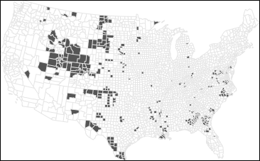

# Pitfalls to avoid


## Representing Count

Let's define a 5km x 5km area and map the location of each individual inside the study area. Let's assume, for sake of argument, that individuals are laid out in a perfect grid pattern. Now let's define two different zoning schemes: one which follows a uniform grid pattern and another that does not. The layout of individuals relative to both zonal schemes are shown in Figure \@ref(fig:grid-vs-tess-layout).

```{r grid-vs-tess-layout, echo=FALSE, fig.cap = "Figure shows the layout of individuals inside two different zonal unit configurations."}

knitr::include_graphics("img/grid_vs_tess_layout.svg")
```

If we sum the number of individuals in each polygon, we get two maps that appear to be giving us two completely different population distribution patterns:

```{r grid-vs-tess-count, echo=FALSE, fig.cap = "Count of individuals in each zonal unit. Note how an underlying point distribution can generate vastly different looking choropleth maps given different aggregation schemes."}

knitr::include_graphics("img/grid_vs_tess_counts.svg")
```

The maps highlight how non-uniform aerial units can fool us into thinking a pattern exists when in fact this is just an artifact of the aggregation scheme. A solution to this problem is to represent counts as **ratios** such as number of deaths per number of people or number of people per square kilometer. In Figure \@ref(fig:grid-vs-tess-density), we opt for the latter ratio (number of people per square kilometer).


```{r grid-vs-tess-density, echo=FALSE, fig.cap = "Point density choropleth maps. The sample study extent is 20x20 units which generates a uniform point density of 1. The slight discrepancy in values for the map on the right is to be expected given that the zonal boundaries do not split the distance between points exactly."}

knitr::include_graphics("img/grid_vs_tess_density.svg")
```

## MAUP

Continuing with the uniform point distribution from the last section, let's assume that as part of the survey, two variables (v1 and v2) were recorded for each point (symbolized as varying shades of green and reds in the two left-hand maps of Figure  \@ref(fig:v1-and-v2-raw)). We might be interested in assessing if the variables v1 and v2 are correlated (i.e. as variable v1 increases in value, does this trigger a monotonic increase or decrease in variable v2?). One way to visualize the relationship between two variables is to generate a bivariate scatter plot (left plot of Figure  \@ref(fig:v1-and-v2-raw)).

```{r v1-and-v2-raw, echo=FALSE, fig.cap = "Plots of variables v1 and v2 for each individual in the survey. The color scheme is sequential with darker colors depicting higher values and lighter colors depicting lower values.", out.width=550}

knitr::include_graphics("img/v1_and_v2_raw.png")
```

It's obvious from the adjoining scatter plot that there is little to no correlation between variables v1 and v2 at the individual level; both the slope and coefficient of determination, $R^2$, are close to $0$.

But many datasets (such as the US census data) are provided to us not at the individual level but at various levels of aggregation units such as the census tract, the county or the state levels. When aggregated, the relationship between variables under investigation may change. For example, if we aggregated v1 and v2 using the uniform aggregation scheme highlighted earlier we get the following relationship.

```{r v1-and-v2-unif, echo=FALSE, fig.cap = "Data summarized using a uniform aggregation scheme. The resulting regression analysis is shown in the right-hand plot. Note the slight increase in slope and $R^2$ values.", out.width=550}

knitr::include_graphics("img/unif_aggr.svg")
```

If we aggregate the same point data using the non-homogeneous aggregation scheme, we get yet another characterization of the relationship between v1 and v2.

```{r v1-and-v2-nonunif, echo=FALSE, fig.cap = "Data summarized using a non-uniform aggregation scheme.The resulting regression analysis is shown in the right-hand plot.", out.width=550}

knitr::include_graphics("img/irr_aggr.svg")
```

Note the high $R^2$ value, yet the underlying v1 and v2 variables from which the aggregated values were computed were not at all correlated! It should be clear by now that different aggregation schemes can result in completely different analyses outcomes. In fact, it would not be impossible to come up with an aggregation scheme that would produce near perfect correlation between variables v1 and v2. 

This problem is often referred to as the **modifiable aerial unit problem (MAUP)** and has, as you can well imagine by now, some serious implications. Unfortunately, this problem is often overlooked in many analyses that involve aggregated data. 


## Ecological Fallacy

But, as is often the case, our analysis is constrained by the data at hand. So when analyzing aggregated data, you must be careful in how you frame the results. For example, if your analysis was conducted with the data summarized using the non-uniform aggregation scheme, you might be tempted to state that there is a strong relationship between variables v1 and v2 at the *individual* level. But doing so leads to the **ecological fallacy** where the statistical relationship at one level of aggregation is (wrongly) assumed to hold at any other levels of aggregation (including at the individual level). In fact, all you can really say is that "*at this level of aggregation, we observe a strong relationship between v1 and v2*" and nothing more!

## Mapping rates

One of the first pitfalls you've been taught to avoid is the mapping of counts when the aerial units associated with these values are not uniform in size and shape. Two options in resolving this problem are: normalizing counts to area and normalizing counts to some underlying population count. An example of the latter is the mapping of infection rates or mortality rates. For example, the following map displays the distribution of kidney cancer death rates (by county) for the period 1980 to 1984.

```{r , echo=FALSE, fig.cap = "Kidney cancer death rates for the period spanning 1980-1984.", out.width=504}

knitr::include_graphics("img/raw_rates.png")
```

Now let's look at the top 10% of counties with the highest death rates.

```{r , echo=FALSE, fig.cap = "Top 10% of counties with the highest kidney cancer death rates.", out.width=466}

knitr::include_graphics("img/top10.png")
```

And now let's look at the bottom 10% of counties with the lowest death rates.

```{r , echo=FALSE, fig.cap = "Bottom 10% of counties with the lowest kidney cancer death rates.", out.width=451}

knitr::include_graphics("img/bottom10.png")
```

A quick glance of these maps suggests clustering of high and low rates around the same parts of the country. In fact, if you were to explore these maps in a GIS, you would note that many of the bottom 10% counties are adjacent to the top 10% counties! If local environmental factors are to blame for kidney cancer deaths, why would they be present in one county and not in an adjacent county? Could differences in regulations between counties be the reason? These are hypotheses that one would probably want to explore, but before pursuing these hypotheses, it would behoove us to look a bit more closely at the batch of numbers we are working with.

Let's first look at a population count map (note that we are purposely not normalizing the count data).

```{r , echo=FALSE, fig.cap = "Population count for each county. Note that a quantile classification scheme is adopted force a large range of values to be assigned a single color swatch", out.width=504}

knitr::include_graphics("img/Population.png")
```

The central part of the states where we are observing both very high and very low cancer death rates seem to have low population counts. Could population count have something to do with this odd congruence of high and low cancer rates? Let's explore the relationship between death rates and population counts outside of a GIS environment and focus solely on the two batches of numbers. The following plot is a scatterplot of death rates and population counts.

```{r , echo=FALSE, fig.cap = "Plot of rates vs population counts. Note the skewed nature of both data batches.", out.width=300}

knitr::include_graphics("img/Rate_vs_pop.png")
```

Transforming both variables reveals much more about the relationship between them. 

```{r , echo=FALSE, fig.cap = "Plot of rates vs population counts on log scales.", out.width=300}
knitr::include_graphics("img/Rate_vs_pop_log.png")
```

One quickly notices a steady decrease in death rate variability about some central value of ~0.000045 (or 4.5e-5) as the population count increases. This is because lower population counts tend to generate the very high and very low rates observed in our data. This begs the question: does low population count cause very high and low cancer death rates, or is this simply a numerical artifact? To answer this question, let's simulate some data. Let's assume that the real death rate is 5 per 100,000 people . If a county has a population of 1000, then $1000 \times 5e-5 = 0.05$ persons would die of kidney cancer; when rounded to the next whole person, that translates to $0$ deaths in that county. Now, there is still the possibility that a county of a 1000 could have one person succumb to the disease in which case the death rate for that county would be $1/1000=0.001$ or 1 in a 1000, a rate much greater than the expected rate of 5 in 100,000! 

This little exercise reveals that you could never calculate a rate of 5 in 100,000 with a population count of just 1000. You either compute a rate of $0$ or a rate of $0.001$ (or more). In fact, you would need a large population count to accurately estimate the real death rate. Turning our attention back to our map, you will notice that a large majority of the counties have a small population count (about a quarter have a population count of 22,000 or less). This explains the wide range of rates observed for these smaller counties; the larger counties don't have such a wide swing in values because they have a larger sample size which can more accurately reflect the true death rate. 

Rates that are computed using relatively small "at risk” population counts are deemed **unstable**.

## Coping with Unstable Rates

To compensate for the small population counts, we can minimize the influence those counties have on the representation of the spatial distribution of rates. One such technique, empirical Bayes (EB) method, does just that. Where county population counts are small, the "rates" are modified to match the overall expected rate (which is an average value of all rates in the map). This minimizes the counties' influence on the range of rate values. EB techniques for rate smoothing aren't available in ArcGIS (as of version 10.2) but are available in a couple of free and open source applications such as [GeoDa](http://geodacenter.asu.edu/projects/opengeoda) and [R](http://www.r-project.org/).

An EB smoothed representation of kidney cancer deaths gives us the following rate vs population plot:

```{r EBRate-vs-pop-log, echo=FALSE, fig.cap = "Plot of EB smoothed rates vs population counts on log scales.", out.width=300}
knitr::include_graphics("img/EBRate_vs_pop_log.png")
```

The variability in rates for smaller counties has decreased. The range of rate values has dropped from 0.00045 to 0.00023. Variability is still greater for smaller counties than larger ones, but not as pronounced as it was with the raw rates 

Maps of the top 10% and bottom 10% EB smoothed rates are shown in the next two figures.

```{r , echo=FALSE, fig.cap = "Top 10% of counties with the highest kidney cancer death rates using EB smoothing techniques.", out.width=466}
knitr::include_graphics("img/top10EB.png")
```

```{r , echo=FALSE, fig.cap = "Bottom 10% of counties with the lowest kidney cancer death rates using EB smoothing technique.", out.width=451}

```

Note the differences in rate distribution. For example, higher rates now show up in Florida which would be expected given the large retirement population, and clusters are now contiguous which could suggest local effects. But it's important to remember that EB smoothing does not reveal the true underlying rate; it only masks those that are unreliable. Also, EB smoothing does not completely eliminate unstable rates--note the slighlty higher rates for low population counts in Figure \@ref(fig:EBRate-vs-pop-log). 

Other solutions to the unstable rate problem include:

 * Grouping small counties into larger ones--thus increasing population sample size.

 * Increasing the study's time interval. In this example, data were aggregated over the course of 5 years (1980-1984) but could be increased by adding 5 more years thus increasing sample sizes in each county.

 * Grouping small counties AND increasing the study's time interval.

These solutions do have their downside in that they decrease the spatial and/or temporal resolutions. 

It should be clear by now that there is no single one-size-fits-all solution to the unstable rate problem. A sound analysis will usually require that one or more of the aforementioned solutions be explored. 

