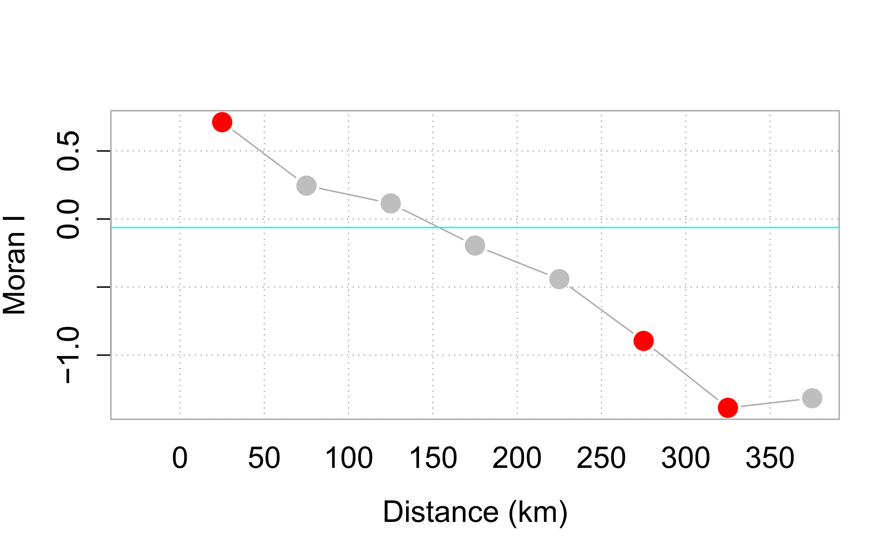

# Spatial Autocorrelation

```{block type="note"}
*"The first law of geography: Everything is related to everything else, but near things are more related than distant things."* Waldo R. Tobler [@Tobler1970] 
```

Mapped events or entities can have non-spatial information attached to them (some GIS software tag these as attributes).  A question often asked is whether or not features with similar values are clustered, randomly distributed or dispersed. In most cases, the distribution of attribute values will seldom show evidence of complete spatial randomness. 

```{r echo=FALSE}
knitr::include_graphics("img/Random_maps.png")
```

Though our visual senses can, in some cases, discern clustered regions from non-clustered regions, the distinction may not always be so obvious. We must therefore come up with a quantitative and objective approach to quantifying the degree to which similar features cluster and where such clustering occurs. One popular test of spatial autocorrelation is the Moran's I test.

## Global Moran's I

### Computing the Moran's I

Let's start with a working example: 2010 per capita income for the state of Maine. 

```{r echo=FALSE, fig.cap="2010 median per capita income aggregated at the county level.", out.width=300, fig.align='center'}
knitr::include_graphics("img/Maine_income.png")
```

It may seem apparent that, when aggregated at the county level, the income distribution follows a north-south trend (i.e. high values appear clustered near the southern end of the state and low values seem clustered near the north and east). But a qualitative description may not be sufficient; we might want to quantify the degree to which similar (or dissimilar) counties are clustered. One measure of this type or relationship is the Moran's I statistic.

The Moran's I index is the correlation coefficient for the relationship between a variable (like income) and its surrounding values. But before we go about computing this correlation, we need to come up with a way to define a neighbor. One approach is to define a neighbor as being any contiguous polygon. For example, the northern most county (Aroostook), has four contiguous neighbors while the southern most county (York) has two contiguous counties. Other neighborhood definitions include distance bands (e.g. counties within 100 km) and k nearest neighbors (e.g. the 2 closest neighbors). Note that distance bands and k nearest neighbors are usually measured using the polygon's centroids and not their boundaries.


```{r echo=FALSE, fig.cap="Maps show the links between each polygon and their respective neighbor(s) based on the neighborhood definition. A contiguous neighbor is defined as one that shares a boundary or a vertex with the polygon of interest.  Orange numbers indicate the number of neighbors for each polygon. Note that the top most county has no neighbors when a neighborhood definition of a 100 km distance band is used (i.e. no centroids are within a 100 km search radius)", out.width=600, fig.align='center'}
knitr::include_graphics("img/Diff_neighbors.png")
```

Once we define a neighborhood for our analysis we identify the neighbors for each polygon in our dataset then summaries the values for each neighborhood cluster (by computing their mean values, for example). This summarized neighbor value is sometimes referred to as a lagging value (*X~lag~*). In our working example, we adopt a contiguity neighborhood and compute the average neighboring income value (*Income~lag~*) for each county in our dataset. We then plot *Income~lag~* vs. *Income* for each county. The Moran's I coefficient between *Income~lag~* and *Income* is nothing more than the slope of the least squares regression line that best fits the points *after* having equalized the spread between both sets of data. 

```{r echo=FALSE, fig.cap="Scatter plot of *Income~lag~* vs. *Income*. If we equalize the spread between both axes (i.e. convert to a z-score) the slope of the regression line represents the Moran's I statistic.", out.width=400, fig.align='center'}
knitr::include_graphics("img/MoranI_scatter_plot.png")
```

If there is no relationship between *Income* and *Income~lag~*, the slope will be close to flat (resulting in a Moran's I value near 0). In our working example, the Moran's I value is 0.377. So this begs the question, how significant is this Moran's I value (i.e. is the computed slope significantly different from 0)? There are two approaches to estimating the significance: an analytical solution and a Monte Carlo solution. The analytical solution makes some restrictive assumptions about the data and thus cannot always be reliable. Another approach (and the one favored here) is a Monte Carlo test which makes *no* assumptions about the dataset including the shape and layout of each polygon.

### Monte Carlo approach to estimating significance

In a Monte Carlo test (a permutation bootstrap test, to be exact), the attribute values are randomly assigned to polygons in the data set and for each permutation of the attribute values, a Moran's I value is computed. The output is a sampling distribution of Moran's I values under the (null) hypothesis that attribute values are randomly distributed across the study area. We then compare our observed Moran's I value to this sampling distribution.

```{r echo=FALSE, fig.cap="Results from 199 permutations. Left plot shows Moran's I slopes (in gray) from each random permutation of income values superimposed with the observed Moran's I slope. Right plot shows the distribution of Moran's I values for all 199 permutations; red vertical line shows our observed Moran's I value of 0.377.", out.width=400, fig.align='center'}
knitr::include_graphics("img/MC_sim_1.png")
```

In our working example, 199 simulations indicate that out observed Moran's I value of 0.377 is not a value we would expect to compute if the income values were randomly distributed across each county. A (pseudo) *P-value* can easily be computed from the simulation results:

$$
\dfrac{N_{extreme}+1}{N+1}
$$ 

where $N_{extreme}$ is the number of simulated Moran's I values more extreme than our observed statistic and $N$ is the total number of simulations. In our working example of 199 simulations where just one simulation result is more extreme than our observed statisic (i.e. $N_{extreme}$ = 1), $p$ = (1 + 1) / (199 + 1) = 0.01. This is interpreted as "*there is a 1% probability that we would be wrong in rejecting the null hypothesis H~o~.*"

## Moran's I at different lags

So far we have looked at spatial autocorrelation where we define neighbors as all polygons sharing a boundary with the polygon of interest. We may also be interested in studying the *ranges* of autocorrelation values as a function of distance. The steps for this type of analysis are straightforward:

1. Compute lag values for a defined set of neighbors.

2. Calculate the Moran's I value for this set of neighbors.

3. Repeat steps 1  and 2  for a different set of neighbors (at a greater distance for example) .

For example, the Moran's I values for income distribution in the state of Maine at distances of 25, 75, 125, up to 375 km are presented in the following plot:

```{r echo=FALSE, fig.cap="Moran's I at different spatial lags defined by a 5 km width annulus at 50 km distance increments. Red dots indicate Moran I values for which a P-value was 0.05 or less.", out.width=400, fig.align='center'}

```

The plot suggests that there is significant spatial autocorrelation between counties within 25 km of one another, but as the distances between counties increases, autocorrelation shifts from being positive to being negative meaning that at greater distances, counties tend to be more dissimilar.

## Local Moran's I

We can decompose the global Moran's I down to its components thus constructing a *localized* measure of autocorrelation--i.e. a map of "hot spots" and "cold spots".

```{r echo=FALSE, fig.cap="Red points and polygons highlight counties with high income values surrounded by high income counties. Blue points and polygons highlight counties with low income values surrounded by low income counties.", out.height=300, out.width=300, fig.align='center'}
knitr::include_graphics(c("img/HH_LL_noP.png", "img/HH_LL_noP_map.png"))
```

Next, we can use Monte Carlo techniques to assess whether or not the High-High values and Low-Low values are significant at a confidence level of 0.05 (i.e. for P-value= 0.05).

```{r echo=FALSE, fig.cap="Significantly High-High and Low-Low clusters with P-values less than or equal to 0.5.", out.height=300, out.width=300, fig.align='center'}
knitr::include_graphics(c("img/HH_LL_P.png", "img/HH_LL_P_map.png"))
```


