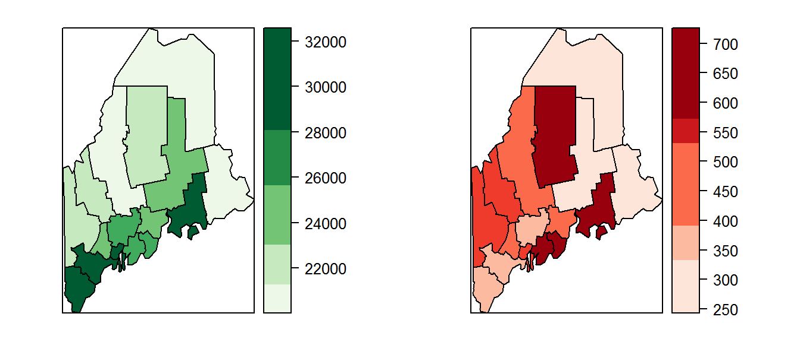
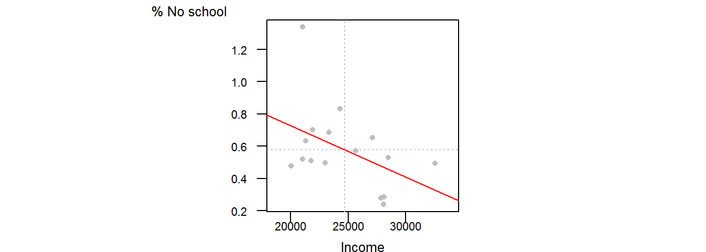

# Uncertainty in Census Data

## Introduction

Many census datasets such as the U.S. Census Bureau's American Community Survey (ACS) data^[The official website is http://www.census.gov/acs/www/, but the data can also be accessed via http://www.socialexplorer.com/] are based on surveys from small samples. This entails that the variables provided by the Census Bureau are only estimates with a level of uncertainty often provided as a margin of error (MoE)  or a standard error (SE). Note that the Bureau's MoE encompasses a 90% confidence interval^[The Bureau's MoE can be computed from the SE as follows: $MoE = 1.645 \times SE$] (i.e. there is a 90% chance that the MoE range covers the true value being estimated). This poses a challenge to both the visual exploration of the data as well as any statistical analyses of that data.

## Mapping uncertainty

One approach to mapping both estimates *and* SE's is to display both as side-by-side maps.

(\#fig:unnamed-chunk-3)Maps of income estimates (left) and associated standard errors (right).

While there is nothing inherently wrong in doing this, it can prove to be difficult to mentally process the two maps, particularly if the data consists of hundreds or thousands of small polygons.

Another approach is to overlay the measure of uncertainty (SE or MoE) as a textured layer on top of the income layer.

(\#fig:unnamed-chunk-4)Map of estimated income (in shades of green) superimposed with different hash marks representing the ranges of income SE.

Or, one could map both ends of the MoE range side by side.

(\#fig:unnamed-chunk-5)Maps of top end of 90 percent income estimate (left) and bottom end of 90 percent income estimate (right).

## Problems in mapping uncertainty

Attempting to convey uncertainty using the aforementioned maps fails to highlight the reason one chooses to map values in the first place: that is to compare values across a spatial domain. More specifically, we are interested in identifying spatial patterns of high or low values. What is implied in the above maps is that the estimates will always maintain their order across the polygons. In other words, if one polygon's estimate is greater than all neighboring estimates, this order will always hold true if another sample was surveyed. But this assumption is incorrect. Each polygon (or county in the above example) can derive different estimates independently from its neighboring polygon. 
Let's look at a bar plot of our estimates.

(\#fig:unnamed-chunk-6)Income estimates by county with 90 percent confidence interval. Note that many counties have overlapping estimate ranges.

Note, for example, how Piscataquis county's income estimate (grey point in the graphic) is lower than that of Oxford county. If another sample of the population was surveyed in each county, the new estimates could place Piscataquis *above* Oxford county in income rankings as shown in the following example:

(\#fig:unnamed-chunk-7)Example of income estimates one could expect to sample based on the 90 percent confidence interval shown in the previous plot.

Note how, in this sample, Oxford's income drops in ranking below that of Piscataquis. A similar change in ranking could occur for York county which drops down *two* counties (Hancock and Lincoln).

How does the *estimated income* map compare with the *simulated income* map?

(\#fig:unnamed-chunk-8)Original income estimate (left) and realization of a simulated sample (right).

A few more simulated samples (using the 90% confidence interval) are shown below:

(\#fig:unnamed-chunk-9)Original income estimate (left) and realizations from simulated samples (R1 through R5).

## Class comparison maps 

There is no single solution to effectively convey both estimates *and* associated uncertainty in a map. Sun and Wong [@DataQuality2010] offer several suggestions dependent on the context of the problem. One approach adopts a class comparison method whereby a map displays both the estimate and a measure of whether the MoE surrounding that estimate extends beyond the assigned class. For example, if we adopt the classification breaks [0 , 20600 , 22800 , 25000 , 27000 , 34000 ], we will find that many of the estimates' MoE extend beyond the classification breaks assigned to those estimates.

(\#fig:compInt)Income estimates by county with 90 percent confidence interval. Note that many of the counties' MoE have ranges that cross into an adjacent class.

Take Piscataquis county, for example. Its estimate is assigned the second classification break (20600 to 22800 ), yet its lower confidence interval stretches into the first classification break indicating that we cannot be 90% confident that the estimate is assigned the proper class (i.e. its true value could fall into the first class). Other counties such as Cumberland and Penobscot don't have that problem since their 90% confidence intervals fall inside the classification breaks. 

This information can be mapped as a hatch mark overlay. For example, income could be plotted using varying shades of green with hatch symbols indicating if the lower interval crosses into a lower class (135&deg; hatch), if the upper interval crosses into an upper class (45&deg; hatch), if both interval ends cross into a different class (90&deg;-vertical-hatch) or if both interval ends remain inside the estimate's class (no hatch).

(\#fig:ComPlot)Plot of income with class comparison hatches.

## Problem when performing bivariate analysis

Data uncertainty issues do not only affect choropleth map presentations but also affect bivariate or multivariate analyses where two or more variables are statistically compared. One popular method in comparing variables is the regression analysis where a line is best fit to a bivariate scatterplot. For example, one can regress "percent not schooled"" to "income"" as follows:

(\#fig:unnamed-chunk-13)Regression between percent not having completed any school grade and median per capita income for each county.

The $R^2$ value associated with this regression analysis is 0.2 and the p-value is 0.081.

But another realization of the survey could produce the following output:

(\#fig:unnamed-chunk-15)Example of what a regression line could look like had another sample been surveyed for each county.

With this new (simulated) sample, the $R^2$ value dropped to 0.07 and the p-value is now 0.322--a much less significant relationship then computed with the original estimate! In fact, if we were to survey  1000 different samples within each county we would get the following range of regression lines:

(\#fig:unnamed-chunk-16)A range of regression lines computed from different samples from each county.

These overlapping lines define a *type* of confidence interval (aka confidence envelope). In other words, the true regression line between both variables lies somewhere within the dark region delineated by this interval.

