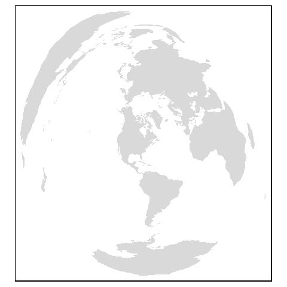
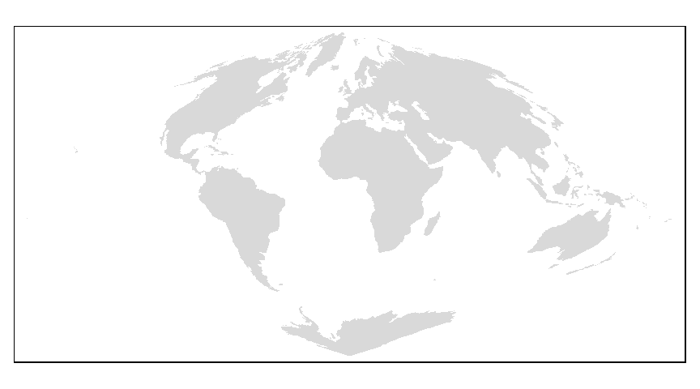

# Coordinate Systems in R {-}

## Sample files for this exercise{-}

Data used in this exercise can be loaded into your current R session by running the following chunk of code.


```r
load(url("http://github.com/mgimond/Spatial/raw/master/Data/Sample1.RData"))
```

Only two data layers will be used in this exercise: a Maine counties polygon layer (`s.sf`) and an elevation raster layer (`elev.r`). The former is in an `sf` format and the latter is in a `raster` format. You can remove the other data objects from your environment via:


```r
rm(list=c("inter.sf", "p.sf", "rail.sf"))
```


## Checking for a coordinate system {-}

To extract coordinate system (CS) information from an `sf` object use `st_crs` from the *sf* package; for a `raster` object use the `crs` function from the *raster* package. 


```r
library(sf)
st_crs(s.sf)
```

```
Coordinate Reference System:
  EPSG: 26919 
  proj4string: "+proj=utm +zone=19 +datum=NAD83 +units=m +no_defs"
```

```r
library(raster)
crs(elev.r)
```

```
CRS arguments:
 +proj=utm +zone=19 +datum=NAD83 +units=m +no_defs +ellps=GRS80
+towgs84=0,0,0 
```

There are two ways of defining a coordinate system: via the **EPSG** numeric [code](http://spatialreference.org/ref/epsg/) or via the **PROJ4** [formatted string](https://proj4.org/apps/proj.html). The EPSG code may not always be available for a particular coordinate system, but if a spatial object has a defined coordinate system, it will always have a PROJ4 projection string. Its multi-parameter syntax is briefly discussed next.

## Understanding the Proj4 coordinate syntax {-}

The [PROJ4](http://proj4.org/) syntax consists of a list of parameters, each prefixed with the `+` character. For example, `elev.r`'s CS is in a UTM projection (`+proj=utm`) for zone 19 (`+zone=19`) and in an NAD 1983 datum (`+datum=NAD83`). Other bits of information that can be gleaned from the projection string are the units (meters) and the underlying ellipsoid (GRS80).

A list of a few of the PROJ4 parameters used in defining a coordinate system follows. Click [here](https://proj4.org/usage/projections.html) for a full list of parameters.

```
+a         Semimajor radius of the ellipsoid axis
+b         Semiminor radius of the ellipsoid axis
+datum     Datum name 
+ellps     Ellipsoid name 
+lat_0     Latitude of origin
+lat_1     Latitude of first standard parallel
+lat_2     Latitude of second standard parallel
+lat_ts    Latitude of true scale
+lon_0     Central meridian
+over      Allow longitude output outside -180 to 180 range, disables wrapping 
+proj      Projection name 
+south     Denotes southern hemisphere UTM zone
+units     meters, US survey feet, etc.
+x_0       False easting
+y_0       False northing
+zone      UTM zone
```

You can view the list of available projections `+proj=` [here](https://proj4.org/operations/projections/).

## Assigning a coordinate system {-}

A coordinate system definition can be passed to a spatial object. It can either fill a spatial object's empty CS definition or it can overwrite and existing definition (the latter should only be executed if there is good reason to believe that the original definition is erroneous). Note that this step **does not** change an objects underlying coordinate system (this option will be discussed in the next section).

We'll pretend that a CS definition was not assigned to `s.sf` and assign one manually using the `st_set_crs()` function.


```r
s.sf <- st_set_crs(s.sf, "+proj=utm +zone=19 +ellps=GRS80 +datum=NAD83") 
```

To do the same with a raster object simply assign the PROJ4 string to the `crs()` function as follows (here too we'll assume that the spatial object had a missing reference system or an incorrectly defined one).


```r
crs(elev.r) <- "+proj=utm +zone=19 +ellps=GRS80 +datum=NAD83"
```

Note that we do not need to define all of the parameters so long as we know that the default values for these unused parameters are correct. Also note that we do not need to designate a hemisphere since the NAD83 datum applies only to North America.

To recreate a CS defined in a software such as ArcGIS, it is best to extract the CS' **WKID/EPSG** code then use that number to look up the PROJ4 syntax on [http://spatialreference.org/ref/](http://spatialreference.org/ref/). For example, in ArcGIS, the WKID number can be extracted from the coordinate system properties output. 

<div class="figure" style="text-align: center">

<p class="caption">(\#fig:fA2-arcgis)An ArcGIS dataframe coordinate system properties window. Note the WKID/EPSG code of 26919 (highlighted in red) associated with the NAD 1983 UTM Zone 19 N CS.</p>
</div>

That number can then be entered in the [http://spatialreference.org/ref/](http://spatialreference.org/ref/)'s search box to pull the Proj4 parameters (note that you must select **Proj4** from the list of syntax options).

<div class="figure" style="text-align: center">

<p class="caption">(\#fig:fA2-epsg)Example of a search result for EPSG **26919** at [http://spatialreference.org/ref/](http://spatialreference.org/ref/). Note that after clicking the `EPSG:269191` link, you must then select the Proj4 syntax from a list of available syntaxes to view the projection parameters</p>
</div>

Here are examples of a few common projections:

Projection                          WKID    Authority    Syntax
---------------------------------  ------- -----------   --------------------
UTM NAD 83 Zone 19N                 26919    EPSG        `+proj=utm +zone=19 +ellps=GRS80 +datum=NAD83 +units=m +no_defs`
USA Contiguous albers equal area    102003   ESRI        `+proj=aea +lat_1=29.5 +lat_2=45.5 +lat_0=37.5 +lon_0=-96 +x_0=0 +y_0=0 +ellps=GRS80 +datum=NAD83 +units=m +no_defs`
Alaska albers equal area            3338     EPSG        `+proj=aea +lat_1=55 +lat_2=65 +lat_0=50 +lon_0=-154 +x_0=0 +y_0=0 +ellps=GRS80 +datum=NAD83 +units=m +no_defs` 
World Robinson                      54030    ESRI        `+proj=robin +lon_0=0 +x_0=0 +y_0=0 +ellps=WGS84 +datum=WGS84 +units=m +no_defs`


## Transforming coordinate systems {-}

The last step showed you how to _define_ or _modify_ the coordinate system _definition_. This section shows you how to **transform** the coordinate values associated with the spatial object to a *different* coordinate system. For example, to transform  the `s.sf`  vector object to a geographic (lat/long) coordinate system, we'll use `sf`'s `st_transform` function.


```r
s.sf.gcs <- st_transform(s.sf, "+proj=longlat +datum=WGS84")
st_crs(s.sf.gcs)
```

```
Coordinate Reference System:
  EPSG: 4326 
  proj4string: "+proj=longlat +datum=WGS84 +no_defs"
```

The raster object equivalent is:


```r
elev.r.gcs <- projectRaster(elev.r, crs="+proj=longlat +datum=WGS84")
crs(elev.r.gcs)
```

```
CRS arguments:
 +proj=longlat +datum=WGS84 +ellps=WGS84 +towgs84=0,0,0 
```

A geographic coordinate system is often desired when overlapping a web based mapping service such as Google, Bing or OpenStreetMap. To check that `s.sf.gcs` was properly transformed, we'll overlay it on top of an OpenStreetMap using the `leaflet` package.


```r
library(leaflet)
leaflet(s.sf.gcs) %>% 
  addPolygons() %>% 
  addTiles()
```

<!--html_preserve--><div id="htmlwidget-8ab21fa262b3c6167ee5" style="width:672px;height:288px;" class="leaflet html-widget"></div>
<script type="application/json" data-for="htmlwidget-8ab21fa262b3c6167ee5">{"x":{"options":{"crs":{"crsClass":"L.CRS.EPSG3857","code":null,"proj4def":null,"projectedBounds":null,"options":{}}},"calls":[{"method":"addPolygons","args":[[[[{"lng":[-68.8202158959377,-68.8198428550497,-69.7172113864081,-70.0141447324675,-69.9849775559489,-69.2302960504507,-69.0469764226522,-69.0367145086766,-68.8948719922673,-68.5146730293485,-68.3912568471377,-68.3348137559721,-68.230806786,-67.7910107465827,-67.7802895897975,-67.7556150667948,-67.7945708237807,-67.7593671297629,-67.8030534244138,-67.8034327853946,-68.0442673817386,-68.257750377734,-68.2572772514418,-68.4078325338314,-68.4341625067183,-68.4319133825422,-68.4224909530257,-68.4387400670548,-68.4362514010004,-68.6938938179388,-68.694252612716,-68.8202158959377],"lat":[46.3975029038531,46.5705359589532,46.5717152261069,46.5705982792126,46.6913656690831,47.4533345006126,47.4220306664875,47.2573616325743,47.1822564988308,47.2969643184046,47.2850971526591,47.3573740966737,47.3521482087837,47.0610036015027,45.9470627402573,45.9165802073734,45.8784756943635,45.8277986000031,45.7945081327697,45.678113625476,45.6357807631594,45.6042463492548,45.5946068090089,45.5720630897562,45.5845974397256,45.7599446848753,45.7710111673874,46.0930094834948,46.3810145069658,46.3848470216072,46.3967944836138,46.3975029038531]}]],[[{"lng":[-70.5522701227431,-70.3963831168109,-70.4162139103224,-70.2539641250507,-70.2474646866552,-70.3102952676871,-70.2800225929669,-70.3048496270618,-70.2293253986392,-70.2834966236554,-70.1910584799657,-70.0466075265628,-70.0141447324675,-69.7172113864081,-69.7289361428492,-69.6834566513733,-69.6495652572825,-69.6752689193327,-69.7052760983507,-69.7206418498994,-69.7029409794692,-69.7193747748989,-69.7086322748495,-69.7304828042506,-69.7265610312492,-69.7650747961707,-69.7782284116274,-69.7939298015476,-69.7913890724336,-69.8119659995251,-69.7944713609759,-69.7784568156373,-69.7356779723452,-69.7394239742407,-69.6972404629698,-69.6985985058636,-69.7105691760799,-69.6957525991532,-69.7110878899268,-69.708417443498,-69.7775637658015,-69.6975434647965,-69.7067752036439,-69.6490560753789,-69.6412510197776,-69.6070545516986,-69.4896050033377,-69.4937861591645,-69.3522667963532,-69.272746818761,-69.2827413720891,-69.2657354010438,-69.3240541092611,-69.3446694749499,-69.3827629018954,-69.3955572045347,-69.4028421993842,-69.4624731039203,-69.4789760059387,-69.6255230025811,-69.6158402577664,-69.5767153087877,-69.5789425716592,-69.6025020127131,-69.7786921613884,-69.7984447826045,-69.8167637270293,-69.8233181813146,-69.8521814235339,-69.9216111657372,-69.9415176967544,-69.9738221777052,-69.9584714493279,-69.9603562874987,-69.9966047653838,-70.0161687162882,-70.0031070530014,-70.0191980092982,-70.0296198941475,-70.0317562409298,-70.0239360067448,-70.0317259355667,-70.1295972351082,-70.1366854782159,-70.1476796422889,-70.1516776708363,-70.1420187040757,-70.144551921604,-70.1074724551224,-70.1553480906383,-70.2900544452034,-70.3085022262742,-70.3631059114116,-70.3603211852718,-70.4176409561967,-70.5247769937588,-70.5104105421308,-70.5522701227431],"lat":[45.6606641600491,45.7220459893141,45.7903090009413,45.8990048581307,45.9446197653656,45.9687822572426,46.053154045756,46.0666583227557,46.1374344001399,46.1902492399916,46.3348397534767,46.4261155181295,46.5705982792126,46.5717152261069,45.9728200712922,45.9768793322142,45.8640350075469,45.8511147692878,45.8827532057036,45.8777445321509,45.8378016491936,45.8264111842189,45.8105004023713,45.7754783851199,45.7552074644893,45.7555012451969,45.7746849026479,45.7536548974274,45.7421308816391,45.7368170304901,45.7243737520221,45.6886267890428,45.6740090360195,45.6562785854827,45.6531084372895,45.6421680458095,45.6384297109118,45.6155303569283,45.6100716616851,45.5806950932391,45.5380285611045,45.2948927775248,45.2924438969726,45.1026815562019,45.1033414360562,45.0131027364687,45.0306879284789,45.0550517308531,45.0730857012569,44.8066218852675,44.8019450165874,44.7232306436125,44.7170578296856,44.7538610252249,44.7519875321387,44.7437477888425,44.7028853841852,44.6957893704716,44.7182725826063,44.6998506517512,44.6607202633483,44.6302072178852,44.6060796937349,44.5794610687403,44.6047777546158,44.5761869498399,44.5808673929988,44.6098355902019,44.6207756708577,44.6087628839574,44.6408703541462,44.6591954632516,44.668774081947,44.6802446359667,44.6758574554751,44.7581767161421,44.7614421837678,44.8158123362954,44.8138362712112,44.8321695135508,44.8337640936887,44.8655134425529,44.8555833334499,44.9005505865838,44.8999516282799,44.920169346162,44.9198908994501,44.9432595462267,44.9485849496765,45.126798305112,45.1123024469935,45.1649104851197,45.1604547160799,45.1521540512333,45.1450127607892,45.5126513681109,45.5136548123547,45.6606641600491]}]],[[{"lng":[-69.7172113864081,-68.8198428550497,-68.8202158959377,-68.8259919945305,-68.9522087549172,-68.9662604970057,-68.858461523151,-68.7750422555106,-68.8727778284688,-68.8532621071251,-69.3522667963532,-69.4937861591645,-69.4896050033377,-69.6070545516986,-69.6412510197776,-69.6490560753789,-69.7067752036439,-69.6975434647965,-69.7775637658015,-69.708417443498,-69.7110878899268,-69.6957525991532,-69.7105691760799,-69.6985985058636,-69.6972404629698,-69.7394239742407,-69.7356779723452,-69.7784568156373,-69.7944713609759,-69.8119659995251,-69.7913890724336,-69.7939298015476,-69.7782284116274,-69.7650747961707,-69.7265610312492,-69.7304828042506,-69.7086322748495,-69.7193747748989,-69.7029409794692,-69.7206418498994,-69.7052760983507,-69.6752689193327,-69.6495652572825,-69.6834566513733,-69.7289361428492,-69.7172113864081],"lat":[46.5717152261069,46.5705359589532,46.3975029038531,45.6844204564528,45.663995574217,45.5125268830041,45.5258563731748,45.2439624650196,45.2294245420211,45.1458950871889,45.0730857012569,45.0550517308531,45.0306879284789,45.0131027364687,45.1033414360562,45.1026815562019,45.2924438969726,45.2948927775248,45.5380285611045,45.5806950932391,45.6100716616851,45.6155303569283,45.6384297109118,45.6421680458095,45.6531084372895,45.6562785854827,45.6740090360195,45.6886267890428,45.7243737520221,45.7368170304901,45.7421308816391,45.7536548974274,45.7746849026479,45.7555012451969,45.7552074644893,45.7754783851199,45.8105004023713,45.8264111842189,45.8378016491936,45.8777445321509,45.8827532057036,45.8511147692878,45.8640350075469,45.9768793322142,45.9728200712922,46.5717152261069]}]],[[{"lng":[-69.3522667963532,-68.8532621071251,-68.8727778284688,-68.7750422555106,-68.858461523151,-68.9662604970057,-68.9522087549172,-68.8259919945305,-68.8202158959377,-68.694252612716,-68.6938938179388,-68.4362514010004,-68.4387400670548,-68.4224909530257,-68.4319133825422,-68.4341625067183,-68.4078325338314,-68.2572772514418,-68.257750377734,-68.0442673817386,-67.9374017094583,-68.0501369866226,-68.3005641369486,-68.2753564985761,-68.3945387366439,-68.3763047508439,-68.4996991235541,-68.4451095291154,-68.6053095321548,-68.6494463147325,-68.6842837023874,-68.7181055754573,-68.7439616967955,-68.7663622296832,-68.7656147491982,-68.7962935157835,-68.8240041181253,-68.8318934588989,-68.8628237858996,-68.8919760946589,-68.8974313708356,-69.1800227685777,-69.20874292804,-69.2657354010438,-69.2827413720891,-69.272746818761,-69.3522667963532],"lat":[45.0730857012569,45.1458950871889,45.2294245420211,45.2439624650196,45.5258563731748,45.5125268830041,45.663995574217,45.6844204564528,46.3975029038531,46.3967944836138,46.3848470216072,46.3810145069658,46.0930094834948,45.7710111673874,45.7599446848753,45.5845974397256,45.5720630897562,45.5946068090089,45.6042463492548,45.6357807631594,45.2683404617007,45.2559714702251,45.225625285573,45.1033141871314,45.0868371353288,44.9955238127473,44.9800582866187,44.7652354827513,44.7429960086222,44.7059329122171,44.7210274178153,44.6999819749911,44.6653601957483,44.6666990193435,44.6762623558473,44.6870575924088,44.6863059676007,44.7007748358146,44.7001375943256,44.6889223824163,44.6932405081234,44.6443454209155,44.7285108739399,44.7232306436125,44.8019450165874,44.8066218852675,45.0730857012569]}]],[[{"lng":[-67.1506607561156,-67.0653586188579,-67.1467066573937,-66.969271036002,-67.0077187507732,-67.2003646079872,-67.3084681377897,-67.3885104555116,-67.5709936034853,-67.6188382601856,-67.8112189325215,-67.8585605201949,-67.9000417759072,-67.9683422418549,-67.9634367619487,-67.986523698359,-68.0112605416211,-67.994902483697,-68.0143975870331,-68.0319000997963,-68.0948005644774,-67.9798366257326,-68.0501369866226,-67.9374017094583,-68.0442673817386,-67.8034327853946,-67.75295518839,-67.7180346034478,-67.6151403324387,-67.4393007416981,-67.4160842433853,-67.5041066625577,-67.4185550888501,-67.4779500777908,-67.4394348623562,-67.3456056765996,-67.2740952251524,-67.1659056488403,-67.1506607561156],"lat":[45.1219899059758,44.9592956420457,44.904581199872,44.8286551275156,44.7806250123542,44.6537812158742,44.6535210559882,44.6914002214265,44.5983332285021,44.5402396088361,44.5540098477743,44.5360772060716,44.4523993326664,44.4712283914674,44.5053274161483,44.4848123430798,44.5883644735857,44.5917442727265,44.6762575380716,44.6747582773663,44.9408935003337,44.9554474307804,45.2559714702251,45.2683404617007,45.6357807631594,45.678113625476,45.6592891772344,45.6812994702931,45.6051989219319,45.59256143012,45.5035545269822,45.4858159950153,45.3758523375688,45.2802804121216,45.1895839720417,45.1222522416315,45.1827832931569,45.1562643909382,45.1219899059758]}]],[[{"lng":[-70.8428755535817,-70.8126658207695,-70.8291320455279,-70.7969669174432,-70.6349296323412,-70.7199105845543,-70.5522701227431,-70.5104105421308,-70.5247769937588,-70.4176409561967,-70.3603211852718,-70.3631059114116,-70.3085022262742,-70.2900544452034,-70.1553480906383,-70.1074724551224,-70.144551921604,-70.1420187040757,-70.1516776708363,-70.1476796422889,-70.1366854782159,-70.1295972351082,-70.0317259355667,-70.0239360067448,-70.0317562409298,-70.0296198941475,-70.0191980092982,-70.0031070530014,-70.0161687162882,-69.9966047653838,-69.9603562874987,-69.9584714493279,-69.9738221777052,-69.9415176967544,-69.9216111657372,-69.9510762154825,-70.0286924982336,-70.0678307090463,-70.0281184576726,-70.041103399177,-70.1244255860475,-70.1991415678467,-70.231269345219,-70.2472614594085,-70.2713022117928,-70.282861506132,-70.3040409660062,-70.2810081130131,-70.5435626925788,-70.5126784193691,-70.6216900739829,-70.7705036527628,-70.7792539248677,-70.7964349417622,-70.8073832592603,-70.8239232011668,-70.7842192902434,-70.8428755535817],"lat":[45.2781374344223,45.3546780062945,45.390726157959,45.425172166096,45.3919670201156,45.5129543699375,45.6606641600491,45.5136548123547,45.5126513681109,45.1450127607892,45.1521540512333,45.1604547160799,45.1649104851197,45.1123024469935,45.126798305112,44.9485849496765,44.9432595462267,44.9198908994501,44.920169346162,44.8999516282799,44.9005505865838,44.8555833334499,44.8655134425529,44.8337640936887,44.8321695135508,44.8138362712112,44.8158123362954,44.7614421837678,44.7581767161421,44.6758574554751,44.6802446359667,44.668774081947,44.6591954632516,44.6408703541462,44.6087628839574,44.5777040311348,44.5891626184213,44.5341786916344,44.5115505836015,44.486835705252,44.4865416655242,44.4795682719719,44.4663314592278,44.5014677561902,44.5071592069827,44.5417080461379,44.5413838564591,44.5754328902419,44.6098681231387,44.6236694445005,44.7930913436198,44.7360427150373,44.8490243722131,44.9211284461481,44.9213914552563,45.0081057188249,45.0149269121093,45.2781374344223]}]],[[{"lng":[-71.00859652032,-71.028726119531,-71.087509250962,-70.9593819057967,-70.8764440530948,-70.8428755535817,-70.7842192902434,-70.8239232011668,-70.8073832592603,-70.7964349417622,-70.7792539248677,-70.7705036527628,-70.6216900739829,-70.5126784193691,-70.5435626925788,-70.2810081130131,-70.3040409660062,-70.282861506132,-70.2713022117928,-70.2472614594085,-70.231269345219,-70.2727964993103,-70.2603743050863,-70.3190657951714,-70.481373238339,-70.5438391707373,-70.6084839810342,-70.5888726294337,-70.6105822518475,-70.6227513315348,-70.8220499671009,-70.8602592796826,-70.8726573850283,-70.8513011697715,-70.8482491865923,-70.804149806531,-70.7185841421246,-70.7468583724156,-70.7318202296122,-70.7539614314786,-70.7555404186005,-70.7771165938087,-70.800547768061,-70.7841356267198,-70.9104967649645,-70.9415338082865,-70.9844425761095,-71.00859652032],"lat":[44.2821463413425,44.6685381145474,45.3014691967229,45.3388657557299,45.2254453701441,45.2781374344223,45.0149269121093,45.0081057188249,44.9213914552563,44.9211284461481,44.8490243722131,44.7360427150373,44.7930913436198,44.6236694445005,44.6098681231387,44.5754328902419,44.5413838564591,44.5417080461379,44.5071592069827,44.5014677561902,44.4663314592278,44.4451413277215,44.3685974403908,44.2183359905128,44.0345038135482,44.009081240216,44.05702007666,44.1216648869569,44.1567737795825,44.1684809226502,44.0790261735915,44.0927013003132,44.0861552382823,44.066045065586,44.0495659416218,44.0382358283531,43.9666552860406,43.9468421059024,43.9291539792658,43.9046327962199,43.8714044938338,43.8714804903597,43.8592884096788,43.8169700524933,43.7999334652607,43.7865326927318,43.7911635594249,44.2821463413425]}]],[[{"lng":[-69.4146409319936,-69.5047286746101,-69.4402439905991,-69.3925757266531,-69.3687576280303,-69.4138931406843,-69.4016350098532,-69.4609000742629,-69.4327713097148,-69.4735046187058,-69.4728642689743,-69.4624731039203,-69.4028421993842,-69.3955572045347,-69.3827629018954,-69.3446694749499,-69.3240541092611,-69.2657354010438,-69.20874292804,-69.1800227685777,-68.8974313708356,-68.8919760946589,-68.8628237858996,-68.8318934588989,-68.8240041181253,-68.8238128576117,-68.8606089041936,-68.8079028528247,-68.8116777613743,-68.9591794546594,-68.9850277535877,-69.0214822561375,-69.0391830747637,-69.1306479241606,-69.2638687978949,-69.3454959565951,-69.392408762234,-69.4146409319936],"lat":[44.3307536571113,44.34158194465,44.4635360614559,44.4577920295634,44.5437052990743,44.5498308677172,44.6357097911499,44.6427621858623,44.6692017760966,44.675155873369,44.6943167370426,44.6957893704716,44.7028853841852,44.7437477888425,44.7519875321387,44.7538610252249,44.7170578296856,44.7232306436125,44.7285108739399,44.6443454209155,44.6932405081234,44.6889223824163,44.7001375943256,44.7007748358146,44.6863059676007,44.6640894944651,44.6109704094898,44.5696542014471,44.4945934637654,44.4303318479482,44.2711125989834,44.2440933215478,44.2524778053302,44.2599653539739,44.3651790990447,44.3132952295856,44.3473284631364,44.3307536571113]}]],[[{"lng":[-70.1244255860475,-70.041103399177,-70.0281184576726,-70.0678307090463,-70.0286924982336,-69.9510762154825,-69.9216111657372,-69.8521814235339,-69.8233181813146,-69.8167637270293,-69.7984447826045,-69.7786921613884,-69.6025020127131,-69.5789425716592,-69.5767153087877,-69.6158402577664,-69.6255230025811,-69.4789760059387,-69.4624731039203,-69.4728642689743,-69.4735046187058,-69.4327713097148,-69.4609000742629,-69.4016350098532,-69.4138931406843,-69.3687576280303,-69.3925757266531,-69.4402439905991,-69.5047286746101,-69.521803804048,-69.5437918731738,-69.645484238664,-69.6663049037611,-69.655953006169,-69.7501220264243,-69.7554626084577,-69.8539836860658,-69.8748813319655,-69.8959241327837,-69.9989009276276,-70.0227277811331,-70.0206829202845,-70.010467008296,-70.0063240320463,-69.9975424703016,-69.9931324442286,-70.0745241535695,-70.0735558324644,-70.1206163832238,-70.1014359376233,-70.1244255860475],"lat":[44.4865416655242,44.486835705252,44.5115505836015,44.5341786916344,44.5891626184213,44.5777040311348,44.6087628839574,44.6207756708577,44.6098355902019,44.5808673929988,44.5761869498399,44.6047777546158,44.5794610687403,44.6060796937349,44.6302072178852,44.6607202633483,44.6998506517512,44.7182725826063,44.6957893704716,44.6943167370426,44.675155873369,44.6692017760966,44.6427621858623,44.6357097911499,44.5498308677172,44.5437052990743,44.4577920295634,44.4635360614559,44.34158194465,44.2864872090229,44.2630422030921,44.2810075331436,44.2351516335172,44.1276148917101,44.1406935467219,44.1572870022011,44.1731715712048,44.1546672201229,44.1124437161336,44.1279011608321,44.1345459613622,44.1586541626059,44.158806777306,44.1751027221868,44.172558418594,44.1824572380572,44.2090598037996,44.2920502894056,44.3741786003832,44.3850274023216,44.4865416655242]}]],[[{"lng":[-69.9989009276276,-70.0184711986249,-70.0327993670678,-70.0213172089434,-70.0378041553175,-70.0340425604061,-70.072700029733,-70.0894620555565,-70.1109918661495,-70.1949849153306,-70.1905371759169,-70.3102828347176,-70.3631700966165,-70.3885841740861,-70.401722092919,-70.4641012017472,-70.481373238339,-70.3190657951714,-70.2603743050863,-70.2727964993103,-70.231269345219,-70.1991415678467,-70.1244255860475,-70.1014359376233,-70.1206163832238,-70.0735558324644,-70.0745241535695,-69.9931324442286,-69.9975424703016,-70.0063240320463,-70.010467008296,-70.0206829202845,-70.0227277811331,-69.9989009276276],"lat":[44.1279011608321,44.044128900467,44.0276878524717,44.0063683144749,43.9854373067738,43.9734708844887,43.9317688917644,43.9386463960397,43.917852617239,43.949924757073,43.9611931717307,44.0393420000071,43.9906553204499,44.0032013781322,43.995354568475,44.0189170141632,44.0345038135482,44.2183359905128,44.3685974403908,44.4451413277215,44.4663314592278,44.4795682719719,44.4865416655242,44.3850274023216,44.3741786003832,44.2920502894056,44.2090598037996,44.1824572380572,44.172558418594,44.1751027221868,44.158806777306,44.1586541626059,44.1345459613622,44.1279011608321]}]],[[{"lng":[-68.0501369866226,-67.9798366257326,-68.0948005644774,-68.0319000997963,-68.0143975870331,-67.994902483697,-68.0112605416211,-67.986523698359,-68.016392975024,-68.0743791531122,-68.1362647248567,-68.2456142454157,-68.3637657385109,-68.4285712449381,-68.5521861992483,-68.5300756653733,-68.5594267980359,-68.7403098746436,-68.8128516927119,-68.8137677435412,-68.7413487010464,-68.7452790217143,-68.8235520760772,-68.8238128576117,-68.8240041181253,-68.7962935157835,-68.7656147491982,-68.7663622296832,-68.7439616967955,-68.7181055754573,-68.6842837023874,-68.6494463147325,-68.6053095321548,-68.4451095291154,-68.4996991235541,-68.3763047508439,-68.3945387366439,-68.2753564985761,-68.3005641369486,-68.0501369866226],"lat":[45.2559714702251,44.9554474307804,44.9408935003337,44.6747582773663,44.6762575380716,44.5917442727265,44.5883644735857,44.4848123430798,44.3849565861996,44.3813743886768,44.475237143451,44.490648016318,44.4313868372113,44.4653064126995,44.3990492534793,44.2898360811521,44.2598872334824,44.3463301474925,44.327432292927,44.4139901601006,44.5072848835823,44.5523206216564,44.608906847383,44.6640894944651,44.6863059676007,44.6870575924088,44.6762623558473,44.6666990193435,44.6653601957483,44.6999819749911,44.7210274178153,44.7059329122171,44.7429960086222,44.7652354827513,44.9800582866187,44.9955238127473,45.0868371353288,45.1033141871314,45.225625285573,45.2559714702251]}],[{"lng":[-68.3879209778224,-68.3502537427093,-68.3554494806484,-68.2387092331955,-68.1647688096706,-68.3047050928408,-68.3207117121614,-68.4028903248613,-68.3879209778224],"lat":[44.3772530665156,44.3989509294124,44.4288577640061,44.4375633292249,44.3344957218999,44.2900314341848,44.2250794777381,44.2708014639226,44.3772530665156]}]],[[{"lng":[-69.3464537614802,-69.3286010016063,-69.2825031771157,-69.3018433863739,-69.2975703819852,-69.3327483293953,-69.4033812204145,-69.4078519090176,-69.4388193795147,-69.444334696573,-69.4401384139667,-69.4186617025143,-69.4146409319936,-69.392408762234,-69.3454959565951,-69.2638687978949,-69.1306479241606,-69.0391830747637,-69.0214822561375,-69.074458413768,-69.219140724011,-69.2936504739293,-69.3464537614802],"lat":[44.0159695715356,44.0111327837857,44.0701680454765,44.0945737055146,44.1286344470103,44.2106289999581,44.2140039295192,44.2232847785959,44.2375813983788,44.3075832125895,44.3225022061022,44.3185658761658,44.3307536571113,44.3473284631364,44.3132952295856,44.3651790990447,44.2599653539739,44.2524778053302,44.2440933215478,44.0690660181456,43.9467875562489,43.9421907766137,44.0159695715356]}]],[[{"lng":[-69.8000128390742,-69.7667552156018,-69.7772762533826,-69.7501220264243,-69.655953006169,-69.6663049037611,-69.645484238664,-69.5437918731738,-69.521803804048,-69.5047286746101,-69.4146409319936,-69.4186617025143,-69.4401384139667,-69.444334696573,-69.4388193795147,-69.4078519090176,-69.4033812204145,-69.3327483293953,-69.2975703819852,-69.3018433863739,-69.2825031771157,-69.3286010016063,-69.3464537614802,-69.3944884353971,-69.4832330546832,-69.5893265359517,-69.6644528575473,-69.6552447931459,-69.6129323416208,-69.7206355816107,-69.7047589904291,-69.8000128390742],"lat":[44.0268667066427,44.0477322340379,44.0741483052384,44.1406935467219,44.1276148917101,44.2351516335172,44.2810075331436,44.2630422030921,44.2864872090229,44.34158194465,44.3307536571113,44.3185658761658,44.3225022061022,44.3075832125895,44.2375813983788,44.2232847785959,44.2140039295192,44.2106289999581,44.1286344470103,44.0945737055146,44.0701680454765,44.0111327837857,44.0159695715356,44.0251280594712,43.8871600707793,43.8448627978378,43.8522244626656,43.980249909285,44.033612835874,43.93797952264,44.0110823784553,44.0268667066427]}]],[[{"lng":[-70.7841356267198,-70.800547768061,-70.7771165938087,-70.7555404186005,-70.7539614314786,-70.7318202296122,-70.7468583724156,-70.7185841421246,-70.804149806531,-70.8482491865923,-70.8513011697715,-70.8726573850283,-70.8602592796826,-70.8220499671009,-70.6227513315348,-70.6105822518475,-70.5888726294337,-70.6084839810342,-70.5438391707373,-70.481373238339,-70.4641012017472,-70.401722092919,-70.3885841740861,-70.3631700966165,-70.3102828347176,-70.1905371759169,-70.1949849153306,-70.1109918661495,-70.0894620555565,-70.072700029733,-70.0340425604061,-70.0296782773,-69.9742338644066,-69.9143113031284,-69.8570440614994,-69.8603320638823,-69.8867908734153,-69.9031321986346,-69.9729033812618,-69.9995000931477,-69.9873704363344,-70.0264027596906,-70.156628531081,-70.2357978471302,-70.2222392276931,-70.3416106023089,-70.4927678994408,-70.4656679631158,-70.5551785569291,-70.5723830928575,-70.5966833834794,-70.6068916802741,-70.6211668013806,-70.6501287820991,-70.6466807052343,-70.6643206023102,-70.6965481542624,-70.7541895764682,-70.7777192820035,-70.7841356267198],"lat":[43.8169700524933,43.8592884096788,43.8714804903597,43.8714044938338,43.9046327962199,43.9291539792658,43.9468421059024,43.9666552860406,44.0382358283531,44.0495659416218,44.066045065586,44.0861552382823,44.0927013003132,44.0790261735915,44.1684809226502,44.1567737795825,44.1216648869569,44.05702007666,44.009081240216,44.0345038135482,44.0189170141632,43.995354568475,44.0032013781322,43.9906553204499,44.0393420000071,43.9611931717307,43.949924757073,43.917852617239,43.9386463960397,43.9317688917644,43.9734708844887,43.9610314395196,43.9201504890162,43.9233278897749,43.9557441638428,43.9225610345792,43.8767134235991,43.7907323426006,43.7688475707295,43.7862077777964,43.8457387523405,43.8456010572037,43.7898104897189,43.6857964225933,43.5772404363104,43.5349087136827,43.6109287585666,43.6457372913715,43.7155249994873,43.6881817913931,43.6961007640772,43.6817844587594,43.7003730432093,43.7038441728716,43.7611588151967,43.7893982331731,43.8047862086547,43.7930026546288,43.8049651916109,43.8169700524933]}]],[[{"lng":[-69.8867908734153,-69.8603320638823,-69.8570440614994,-69.9143113031284,-69.9742338644066,-70.0296782773,-70.0340425604061,-70.0378041553175,-70.0213172089434,-70.0327993670678,-70.0184711986249,-69.9989009276276,-69.8959241327837,-69.8748813319655,-69.8539836860658,-69.7554626084577,-69.7501220264243,-69.7772762533826,-69.8599284586111,-69.7915280108674,-69.8303921783115,-69.8517853298484,-69.846155681275,-69.8867908734153],"lat":[43.8767134235991,43.9225610345792,43.9557441638428,43.9233278897749,43.9201504890162,43.9610314395196,43.9734708844887,43.9854373067738,44.0063683144749,44.0276878524717,44.044128900467,44.1279011608321,44.1124437161336,44.1546672201229,44.1731715712048,44.1572870022011,44.1406935467219,44.0741483052384,44.000001079988,43.7560849721624,43.727986253957,43.7443279936087,43.8423439818324,43.8767134235991]}],[{"lng":[-69.8000128390742,-69.7047589904291,-69.7206355816107,-69.7485283787592,-69.7246713234987,-69.750359444337,-69.7776729687166,-69.8000128390742],"lat":[44.0268667066427,44.0110823784553,43.93797952264,43.8933754158225,43.784477160251,43.7617041045157,43.7912707419824,44.0268667066427]}]],[[{"lng":[-70.9642682700125,-70.9496195381735,-70.9565243949817,-70.9738741894367,-70.9844425761095,-70.9415338082865,-70.9104967649645,-70.7841356267198,-70.7777192820035,-70.7541895764682,-70.6965481542624,-70.6643206023102,-70.6466807052343,-70.6501287820991,-70.6211668013806,-70.6068916802741,-70.5966833834794,-70.5723830928575,-70.5551785569291,-70.4656679631158,-70.4927678994408,-70.3416106023089,-70.365925605278,-70.45697679942,-70.5389410988088,-70.665672117895,-70.8186681476027,-70.83054816075,-70.8132073801978,-70.9010858877487,-70.9058011432221,-70.9696996127229,-70.9790994556783,-70.9614829222242,-70.9707912274419,-70.9592784013261,-70.9642682700125],"lat":[43.5319898668848,43.5489536176379,43.5641434944728,43.5718299188238,43.7911635594249,43.7865326927318,43.7999334652607,43.8169700524933,43.8049651916109,43.7930026546288,43.8047862086547,43.7893982331731,43.7611588151967,43.7038441728716,43.7003730432093,43.6817844587594,43.6961007640772,43.6881817913931,43.7155249994873,43.6457372913715,43.6109287585666,43.5349087136827,43.4303037178793,43.3494706632996,43.335718193147,43.0910505641212,43.1218710665584,43.1591741192742,43.2352227081839,43.2810200174417,43.3020692937648,43.3663799680073,43.3961839197787,43.4381263868541,43.4702114776979,43.5163879925243,43.5319898668848]}]]],null,null,{"interactive":true,"className":"","stroke":true,"color":"#03F","weight":5,"opacity":0.5,"fill":true,"fillColor":"#03F","fillOpacity":0.2,"smoothFactor":1,"noClip":false},null,null,null,{"interactive":false,"permanent":false,"direction":"auto","opacity":1,"offset":[0,0],"textsize":"10px","textOnly":false,"className":"","sticky":true},null]},{"method":"addTiles","args":["//{s}.tile.openstreetmap.org/{z}/{x}/{y}.png",null,null,{"minZoom":0,"maxZoom":18,"tileSize":256,"subdomains":"abc","errorTileUrl":"","tms":false,"noWrap":false,"zoomOffset":0,"zoomReverse":false,"opacity":1,"zIndex":1,"detectRetina":false,"attribution":"&copy; <a href=\"http://openstreetmap.org\">OpenStreetMap<\/a> contributors, <a href=\"http://creativecommons.org/licenses/by-sa/2.0/\">CC-BY-SA<\/a>"}]}],"limits":{"lat":[43.0910505641212,47.4533345006126],"lng":[-71.087509250962,-66.969271036002]}},"evals":[],"jsHooks":[]}</script><!--/html_preserve-->

Next, we'll explore other transformations using a `tmap` dataset of the world


```r
library(tmap)
data(World)  # The data is stored as an sf object
 
# Let's check its current coordinate system
st_crs(World)
```

```
Coordinate Reference System:
  No EPSG code
  proj4string: "+proj=eck4 +lon_0=0 +x_0=0 +y_0=0 +datum=WGS84 +units=m +no_defs"
```


The following chunk transforms the world map to an Azimuthal equidistant projection centered on latitude `0` and longitude `0`.


```r
World.ae <- st_transform(World, "+proj=aeqd +lat_0=0 +lon_0=0 +x_0=0 +y_0=0 +ellps=WGS84 +datum=WGS84 +units=m +no_defs")

tm_shape(World.ae) + tm_fill() 
```


The following chunk transforms the world map to an Azimuthal equidistant projection centered on Maine.
 

```r
World.aemaine <- st_transform(World, "+proj=aeqd +lat_0=44.5 +lon_0=-69.8 +x_0=0 +y_0=0 +ellps=WGS84 +datum=WGS84 +units=m +no_defs")

tm_shape(World.aemaine) + tm_fill()  
```



The following chunk transforms the world map to a World Robinson projection.
 

```r
World.robin <- st_transform(World,"+proj=robin +lon_0=0 +x_0=0 +y_0=0 +ellps=WGS84 +datum=WGS84 +units=m +no_defs")
tm_shape(World.robin) + tm_fill()  
```


The following chunk transforms the world map to a World sinusoidal projection.


```r
World.sin <- st_transform(World,"+proj=sinu +lon_0=0 +x_0=0 +y_0=0 +ellps=WGS84 +datum=WGS84 +units=m +no_defs")
tm_shape(World.sin) + tm_fill()  
```



The following chunk transforms the world map to a World Mercator projection.


```r
World.mercator <- st_transform(World,"+proj=merc +lon_0=0 +k=1 +x_0=0 +y_0=0 +ellps=WGS84 +datum=WGS84 +units=m +no_defs")
tm_shape(World.mercator) + tm_fill()  
```


### Example of a failed transformation {-}

An issue that can come up when transforming spatial data is when the location of the tangent line(s) or points in the CS definition forces polygon features to be split across the 180&deg; meridian. For example, re-centering the mercator projection to -69&deg; will create the following map.


```r
World.mercator2 <- st_transform(World, "+proj=merc +lon_0=-69 +k=1 +x_0=0 +y_0=0 +ellps=WGS84 +datum=WGS84 +units=m +no_defs")

tm_shape(World.mercator2) + tm_borders()
```


The polygons are split and R does not know how to piece them together.

One solution is to make use of `maptools`' `nowrapSpatialPolygons()` function. This function will split the polygon at a given longitude however, it requires that the object be of `Spatial*` type and that it be in a geographic (lat/long) reference system. The following chunk is a sample workflow. 


```r
library(maptools)

# Convert to lat/long reference system
wld.ll <- st_transform(World, "+proj=longlat +datum=WGS84 +no_defs")

# Convert to a spatial object, then split the polygons at a given longitude (111 in this example)
wld.sp <- nowrapSpatialPolygons(as(wld.ll, "Spatial"), offset = 111)

# Now convert back to an sf object, reproject to a new longitude center at -69 degrees 
# then plot it
wld.sf <- st_as_sf(wld.sp)
wld.merc2.sf <- st_transform(wld.sf, "+proj=merc +lon_0=-69 +k=1 +x_0=0 +y_0=0 +ellps=WGS84 +datum=WGS84 +units=m +no_defs")
tm_shape(wld.merc2.sf) + tm_borders()
```


You'll note that the Antarctica polygon is deformed in this transformation. In such a case, you might need to remove the Antarctica polygon before proceeding with the `nowrapSpatialPolygons` or you can adopt another projection. In the following example, a Robinson projection is used _in lieu of_ a Mercator.


```r
wld.rob.sf <- st_transform(wld.sf,"+proj=robin +lon_0=-69 +x_0=0 +y_0=0 +ellps=WGS84 +datum=WGS84 +units=m +no_defs")
tm_shape(wld.rob.sf) + tm_borders()
```


One downside to the the `nowwrapSpatialPolygons` solution is the loss of the attribute table.


```r
head(data.frame(wld.rob.sf), 4)
```

```
                        geometry
1 MULTIPOLYGON (((11566048 38...
2 MULTIPOLYGON (((8046523 -62...
3 MULTIPOLYGON (((7724367 447...
4 MULTIPOLYGON (((11102301 25...
```

A (not so perfect) solution is to create a centroid from the polygons prior to projecting them, then performing a spatial join of the transformed points to the transformed polygons.


```r
# Create centroid from polygons
pt <- st_centroid(World, of_largest_polygon = TRUE)

# Transform points to the recentered Robinson projection
pt.rob <- st_transform(pt,"+proj=robin +lon_0=-69 +x_0=0 +y_0=0 +ellps=WGS84 +datum=WGS84 +units=m +no_defs")

# Perform the spatial join (joining the point attribute values to the wld.rob.sf polygons)
wld.rob.df.sf <- st_join(wld.rob.sf, pt.rob, join = st_contains)

# Map the output
tm_shape(wld.rob.df.sf) + tm_polygons(col="pop_est_dens", style="quantile") +
  tm_legend(outside=TRUE)
```


While this solution appears to work for most polygons a few, such as Norway, have missing values. To see why, let's zoom in on Norway using the unprojected layers and overlapping the map with the centroids.


```r
library(dplyr)

# Extract the extent for the Norwar/Sweden region
nor.bb <- World %>% filter(name == "Norway" | name == "Sweden") %>% st_bbox()

# Plot the data zoomed in on the region. Add the point layer for reference
tm_shape(World, bbox=nor.bb) + tm_polygons(col="pop_est_dens", style="quantile") +
  tm_shape(pt) + tm_dots() +
  tm_text("name", just="left", xmod=0.5, size=0.8) +
  tm_legend(outside=TRUE)
```


You'll notice that the Norway point falls inside the Sweden polygon. This is a result of the "C" shaped nature of Norway and `st_centroid`'s use of the geometric center in computing the centroid and not the "center of mass".

An alternate solution is the use of `st_point_on_surface()` which will place a point _inside_  the polygons.


```r
pt <- st_point_on_surface(World)

pt.rob <- st_transform(pt,"+proj=robin +lon_0=-69 +x_0=0 +y_0=0 +ellps=WGS84 +datum=WGS84 +units=m +no_defs")
wld.rob.df.sf <- st_join(wld.rob.sf, pt.rob, join = st_contains)
tm_shape(wld.rob.df.sf) + tm_polygons(col="pop_est_dens", style="quantile") +
  tm_legend(outside=TRUE)
```


 
## A note about containment {-}

While in theory, a point completely enclosed by a bounded area should always remain bounded by that area in any projection, this is not always the case in practice. This is because the transformation applies to the vertices that define the line segments and not the lines themselves. So if a point is inside of a polygon and very close to one of its boundaries in its native projection, it may find itself on the other side of that line segment in another projection hence outside of that polygon. In the following example, a polygon layer and point layer are created in a Miller coordinate system where the points are enclosed in the polygons.


```r
# Define a dew projections
miller <- "+proj=mill +lat_0=0 +lon_0=0 +x_0=0 +y_0=0 +ellps=WGS84 +datum=WGS84 +units=m +no_defs"
lambert <- "+proj=lcc +lat_1=20 +lat_2=60 +lat_0=40 +lon_0=-96 +x_0=0 +y_0=0 +ellps=GRS80 +datum=NAD83 +units=m +no_defs"

# Subset the World data layer
wld.mil <-  World %>% filter( iso_a3  == "CAN" |  iso_a3 == "USA") %>% st_transform( miller)

# Create polygon and point layers in the Miller projection  
sf1 <- st_sfc( st_polygon(list(cbind(c(-13340256,-13340256,-6661069, -6661069, -13340256),
                               c(7713751, 5326023, 5326023,7713751, 7713751 )))), crs = miller) 

pt1 <- st_sfc( st_multipoint(rbind(c(-11688500,7633570), c(-11688500,5375780),
                                  c(-10018800,7633570), c(-10018800,5375780),
                                  c(-8348960,7633570), c(-8348960,5375780))),  crs = miller)
pt1 <- st_cast(pt1, "POINT") # Create single part points

# Plot the data layers in their native projection
tm_shape(wld.mil) +tm_fill(col="grey") + 
  tm_grid( x=c(-60,-80,-100, -120, -140), 
           y = c(30,45, 60), 
           projection = "+proj=longlat",
           labels.size = 0, col="grey90") +
  tm_shape(sf1) + tm_polygons("red", alpha = 0.5, border.col = "yellow") +
  tm_shape(pt1) + tm_dots(size=0.2) 
```


The points are close to the boundaries, but are inside of the polygon nonetheless. To confirm, we can run `st_contains` on the dataset:


```r
st_contains(sf1, pt1)
```

```
Sparse geometry binary predicate list of length 1, where the predicate was `contains'
 1: 1, 2, 3, 4, 5, 6
```

All six points are selected, as expected.

Now, let's reproject the data into a Lambert conformal projection.


```r
# Transform the data
wld.lam <- st_transform(wld.mil, lambert)
pt1.lam <- st_transform(pt1, lambert)
sf1.lam <- st_transform(sf1, lambert)

# Plot the data in the Lambert coordinate system
tm_shape(wld.lam) +tm_fill(col="grey") + 
  tm_grid( x=c(-60,-80,-100, -120, -140), 
           y = c(30,45, 60), 
           projection = "+proj=longlat",
           labels.size = 0, col="grey90") +
  tm_shape(sf1.lam) + tm_polygons("red", alpha = 0.5, border.col = "yellow") +
  tm_shape(pt1.lam) + tm_dots(size=0.2)   
```


Only three of the points are contained. We can confirm this using the `st_contains` function:


```r
st_contains(sf1.lam, pt1.lam)
```

```
Sparse geometry binary predicate list of length 1, where the predicate was `contains'
 1: 1, 3, 5
```

To resolve this problem, one should _densify_ the the polygon by adding more vertices along the line segment. The vertices density will be dictated by the resolution needed to preserve the map's containment properties and is best determined experimentally.

We'll use the `st_segmentize` function to create vertices at 1 km (1000 m) intervals.


```r
# Add vertices every 1000 meters along the polygon's line segments
sf2 <- st_segmentize(sf1, 1000)

# Transform the newly densified polygon layer
sf2.lam <- st_transform(sf2, lambert)

# Plot the data
tm_shape(wld.lam) + tm_fill(col="grey") + 
  tm_grid( x=c(-60,-80,-100, -120, -140), 
           y = c(30,45, 60), 
           projection = "+proj=longlat",
           labels.size = 0, col="grey90") +
  tm_shape(sf2.lam) + tm_polygons("red", alpha = 0.5, border.col = "yellow") +
  tm_shape(pt1.lam) + tm_dots(size=0.2) 
```


Now all points remain contained by the polygon. We can check via:


```r
st_contains(sf2.lam, pt1.lam)
```

```
Sparse geometry binary predicate list of length 1, where the predicate was `contains'
 1: 1, 2, 3, 4, 5, 6
```

## Creating Tissot indicatrix circles {-}

Most projections will distort some aspect of a spatial property, especially area and shape. A nice way to visualize the distortion afforded by a projection is to create geodesic circles.

First, create a point layer that will define the circle centers in a lat/long coordinate system.


```r
tissot.pt <- st_sfc( st_multipoint(rbind(c(-60,30), c(-60,45), c(-60,60),
                                  c(-80,30), c(-80,45), c(-80,60),
                                  c(-100,30), c(-100,45), c(-100,60),
                                  c(-120,30), c(-120,45), c(-120,60) )),  crs = "+proj=longlat")
tissot.pt <- st_cast(tissot.pt, "POINT") # Create single part points
```

Next we'll construct geodesic circles from these points using the `geosphere` package.


```r
library(geosphere)

cr.pt <- list() # Create an empty list

# Loop through each point in tissot.pt and generate 72 points at 300 km
# from the tissot.pt point in all directions at 1 degree increment
for (i in 1:length(tissot.pt)){
  cr.pt[[i]] <- list( destPoint( as(tissot.pt[i], "Spatial"), b=seq(0,360,1), d=300000) )
}

# Create a closed polygon from the previously generated points
tissot.sfc <- st_cast( st_sfc(st_multipolygon(cr.pt ),crs = "+proj=longlat"), "POLYGON" )
```

We'll check that these are indeed geodesic circles by computing the geodesic area of each polygon. We'll use the `st_area` function from `sf` which will revert to geodesic area calculation if a lat/long coordinate system is present.


```r
tissot.sf <- st_sf( geoArea =  st_area(tissot.sfc), tissot.sfc )
```

The true area of the circles should be $\pi * r^2$ or 2.8274334\times 10^{11} square meters in our example. Let's compute the error in the `tissot` output. The values will be reported as fractions.


```r
( (pi * 300000^2) -  as.vector(tissot.sf$geoArea) ) / (pi * 300000^2)
```

```
 [1] 0.0002356458 0.0002350269 0.0002344091 0.0002356458 0.0002350269
 [6] 0.0002344091 0.0002356458 0.0002350269 0.0002344091 0.0002356458
[11] 0.0002350269 0.0002344091
```

In all cases, the error is less than 0.1%. The error is primarily due to the discretization of the circle parameter. 

Let's now take a look at the distortions associated with a few popular coordinate systems. We'll start by exploring the Mercator projection.


```r
# Transform geodesic circles and compute area error as a percentage
tissot.merc <- st_transform(tissot.sf, "+proj=merc +ellps=WGS84")
tissot.merc$area_err <- round((st_area(tissot.merc, tissot.merc$geoArea)) / 
                                tissot.merc$geoArea * 100 , 2)

# Plot the map
tm_shape(World, bbox = st_bbox(tissot.merc), projection = st_crs(tissot.merc)) + 
  tm_borders() + 
  tm_shape(tissot.merc) + tm_polygons(col="grey", border.col = "red", alpha = 0.3) + 
  tm_grid(x=c(-60,-80,-100, -120, -140), 
           y = c(30,45, 60),
          projection = "+proj=longlat", labels.size = 0, col="grey80") +
  tm_text("area_err", size=.8, alpha=0.8, col="blue")
```


The mercator projection does a good job at preserving shape, but the area's distortion increases dramatically poleward.

Next, we'll explore the Lambert azimuthal equal area projection centered at 45 degrees north and 100 degrees west.


```r
# Transform geodesic circles and compute area error as a percentage
tissot.laea <- st_transform(tissot.sf, "+proj=laea +lat_0=45 +lon_0=-100 +ellps=WGS84")
tissot.laea$area_err <- round( (st_area(tissot.laea ) - tissot.laea$geoArea) / 
                                 tissot.laea$geoArea * 100, 2)

# Plot the map
tm_shape(World, bbox = st_bbox(tissot.laea), projection = st_crs(tissot.laea)) + 
  tm_borders() + 
  tm_shape(tissot.laea) + tm_polygons(col="grey", border.col = "red", alpha = 0.3) + 
  tm_grid(x=c(-60,-80,-100, -120, -140), 
           y = c(30,45, 60),
          projection = "+proj=longlat", labels.size = 0, col="grey80") +
  tm_text("area_err", size=.8, alpha=0.8, col="blue")
```


The area error across the 48 states is near 0. But note that the shape does become distorted as we move away from the center of projection.

Next, we'll explore the Robinson projection.


```r
# Transform geodesic circles and compute area error as a percentage
tissot.robin <- st_transform(tissot.sf, "+proj=robin  +ellps=WGS84")
tissot.robin$area_err <- round(  (st_area(tissot.robin ) - tissot.robin$geoArea) / 
                                   tissot.robin$geoArea * 100, 2)

# Plot the map
tm_shape(World, bbox = st_bbox(tissot.robin), projection = st_crs(tissot.robin)) + 
  tm_borders() + 
  tm_shape(tissot.robin) + tm_polygons(col="grey", border.col = "red", alpha = 0.3) + 
  tm_grid(x=c(-60,-80,-100, -120, -140), 
           y = c(30,45, 60),
          projection = "+proj=longlat", labels.size = 0, col="grey80") +
  tm_text("area_err", size=.8, alpha=0.8, col="blue")
```


Both shape and area are measurably distorted for the north american continent. 
