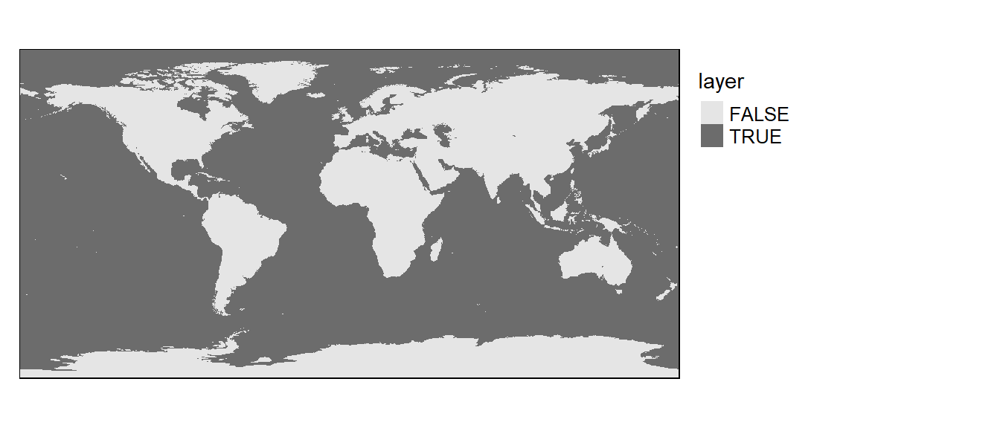

# Raster operations in R{-}

We'll first load spatial objects used in this exercise from a remote website: an elevation raster, a bathymetry raster and a continents polygon vector layer. These objects will be loaded as R spatial objects and will therefore not require conversion.


```r
library(raster)
z <- gzcon(url("http://colby.edu/~mgimond/Spatial/Data/elevation.rds"))
r1 <- readRDS(z)

z <- gzcon(url("http://colby.edu/~mgimond/Spatial/Data/bathymetry.rds"))
r2 <- readRDS(z)

z <- gzcon(url("http://colby.edu/~mgimond/Spatial/Data/continents.rds"))
s1 <- readRDS(z)
```

Both rasters cover the entire globe. Elevation below mean sea level are encoded as `0` in the elevation raster. Likewise, bathymetrty values above mean sea level are encoded as `0`.

Note that most of the map algebra operations and functions covered in this tutorial are implemented using the `raster` package.

## Local operations and functions {-}

### Unary operations and functions (applied to single raster) {-}

Most algebreic operations can be applied to rasters as they would with any vector element. For example, to convert all bathymetric values in `r2` (currently recorded as postive values)  to *negative* values simply multiply the raster by `-1`.


```r
library(raster)
r2b <- r2 * (-1)
```

Another unary operation that can be applied to a raster is reclassification. In the following example, we will assign all values in `r2b` less than zero  `1` and all zero values will remain unchanged. A simple way to do this is to apply a conditional statement.


```r
r2c <- r2b < 0
```

Let's look at the output. Note that all `0` pixels are coded as `FALSE` and all `1` pixels are coded as `TRUE`.


```r
library(tmap)
tm_shape(r2c) + tm_raster(palette = "Greys") + 
  tm_legend(outside = TRUE, text.size = .8) 
```



If a more elaborate form of reclassification is desired, you can use the `reclassify` function. In the following example, the raster object `r2` is reclassified to 4 unique values: 100, 500, 1000 and 11000 as follows:

Original depth values | Reclassified values
--------------------- | -------------------
0 - 100               | 100
101 - 500             | 500
501 - 1000            | 1000
1001 - 11000          | 11000

The first step is to create a plain matrix where the first and second columns list the starting and ending values of the range of `r` values that are to be reclassified, and where the third column lists the new raster cell values.


```r
m <- c(0, 100, 100,  100, 500, 500,  500, 
       1000,  1000, 1000, 11000, 11000)
m <- matrix(m, ncol=3, byrow = T)
m
```

```
     [,1]  [,2]  [,3]
[1,]    0   100   100
[2,]  100   500   500
[3,]  500  1000  1000
[4,] 1000 11000 11000
```


```r
r2c <- reclassify(r2, m, right = T)
```

The `right=T` parameter indicates that the intervals should be closed to the right (i.e. inclusive).


```r
tm_shape(r2c) + tm_raster(style="cat") + tm_legend(outside = TRUE, text.size = .8) 
```


You can also assign `NA` (missing) values to pixels. For example, to assign `NA` values to cells that are equal to 100, type


```r
r2c[r2c == 100] <- NA
```

The following chunk of code shows all pixels whose value is `NA` in a grey color.


```r
tm_shape(r2c) + tm_raster(showNA=TRUE, colorNA="grey") + 
  tm_legend(outside = TRUE, text.size = .8) 
```


### Binary operations and functions (where two layers are used) {-}

In the following example, `r1` (elevation raster) is added to `r2` (bathymetry raster) to create a single elevation raster for the globe. Note that the bathymetric raster will need to be muliplied by `-1` to differentiate above mean sea level elevation from bellow mean sea level.


```r
elev <- r1 - r2
```


```r
tm_shape(elev) + tm_raster(palette="-RdBu",n=6) + 
  tm_legend(outside = TRUE, text.size = .8) 
```


## Focal operations and functions {-}

Operations or functions applied focally to rasters involve the cell whose value we are computing and all user defined neighboring cells. For example, a cell output value can be the average of all 121 cells--an 11x11 kernel--centered on the cell whose value is being estimated (this acts as a _smoothing function_).

Next, we apply the `focal` function to `r2`.


```r
f1 <- focal(elev, w=matrix(1,nrow=11,ncol=11)  , fun=mean)
```


```r
tm_shape(f1) + tm_raster(palette="-RdBu",n=6) + 
  tm_legend(outside = TRUE, text.size = .8) 
```


Notice that the edge cells have been assigned a value of `NA`. This is because cells outside of the extent have no value. You can remedy this by passing the parameters `na.rm=TRUE` and `pad=TRUE` .


```r
f1 <- focal(elev, w=matrix(1,nrow=11,ncol=11)  , 
            fun=mean, pad=TRUE,  na.rm = TRUE)
```


```r
tm_shape(f1) + tm_raster(palette="-RdBu",n=6) + 
  tm_legend(outside = TRUE, text.size = .8) 
```


The _neighbors_ matrix (or _kernel_) that defines the moving window can be customized. For example if we wanted to compute the average of all 8 neighboring cells _excluding_ the central cell we could write the following:


```r
m  <- matrix(c(1,1,1,1,0,1,1,1,1)/8,nrow = 3) 
f2 <- focal(elev, w=m, fun=sum)
```

More complicated kernels can be defined. In the following example, a [Sobel][2] filter (used for edge detection in image processing) is defined then applied to the raster layer `elev`.


```r
Sobel <- matrix(c(-1,0,1,-2,0,2,-1,0,1) / 4, nrow=3) 
f3    <- focal(elev, w=Sobel, fun=sum) 
tm_shape(f3) + tm_raster(palette="Greys") + 
  tm_legend(legend.show = FALSE) 
```


## Zonal operations and functions {-}

A common zonal operation is the aggregation of cells. In the following example, raster layer `elev` is aggregated to a 5x5 raster layer.


```r
z1 <- aggregate(elev, fact=2, fun=mean, expand=TRUE)

tm_shape(z1) + tm_raster(palette="-RdBu",n=6) + 
  tm_legend(outside = TRUE, text.size = .8) 
```


The image may not look much different from the original, but a look at the image properties will show a difference in pixel sizes.


```r
res(elev)
```

```
[1] 0.3333333 0.3333333
```

```r
res(z1)
```

```
[1] 0.6666667 0.6666667
```

`z1`'s pixel dimensions are half of `elev`'s dimensions. You can reverse the process by using the `disaggregate` function which will split a cell into the desired number of subcells while assigning each one the same parent cell value.

Zonal operations can often involve two layers, one with the values to be aggregated, the other with the defined zones. In the next example, `elev`'s cell values are averaged by zones defined by the raster layer `l4`.

First, we generate a table with summed cell values `r` for each each zone `l4`,


```r
s1.elev <- extract(elev, s1, fun=mean, sp=TRUE) 
```

The `sp=TRUE` parameter instructs the function to output a `SpatialPolygonsDataFrame` object (same as the input zonal object) instead of a standalone table (matrix). The output spatial object inherits the original attributes and adds a column called `layer` with the computed mean elevation values.


```r
s1.elev@data
```

```
      CONTINENT     layer
0        Africa  630.6979
1    Antarctica 2370.8633
2          Asia  790.6696
3     Australia  276.5497
4        Europe  262.7611
5 North America  826.4162
6 South America  595.6067
```

We can map the average elevation by continent.


```r
tm_shape(s1.elev) + tm_polygons(col="layer") + 
  tm_legend(outside = TRUE, text.size = .8)
```


Many custom functions can be applied to `extract`. For example, to extract the maximum elevation value by continent, type:


```r
s1.elev <- extract(elev, s1, fun=max, sp=TRUE) 
```

As another example, we may wish to extract the number of cells in each polygon. 


```r
s1.elev <- extract(elev, s1, fun=function(x,...){length(x)}, sp=TRUE) 
```

The `extract` function will also work with lines and points spatial objects. If you wish to compute the zonal statistics of a raster using a another raster as zones instead of a polygon, use the `zonal` function instead.

## Global operations and functions {-}

Global operations and functions may make use of all input cells of a grid in the computation of an output cell value.

An example of a global function is the Euclidean distance tool, `distance`,  which computes the shortest distance between a pixel and a source (or destination) location. To demonstrate the `distance` function, we'll first create a new raster layer with two non-NA pixels.


```r
r1   <- raster(ncol=100, nrow=100, xmn=0, xmx=100, ymn=0, ymx=100)
r1[] <- NA              # Assign NoData values to all pixels
r1[c(850, 5650)] <- 1   # Change the pixels 20 and 85  to 1
```


```r
tm_shape(r1) + tm_raster(palette="red") + 
  tm_legend(outside = TRUE, text.size = .8) 
```


Next, we'll compute a Euclidean distance raster from these two cells. The output extent will default to the input raster extent.


```r
r1.d <- distance(r1) 
```


```r
tm_shape(r1.d) + tm_raster(palette = "Greens", style="order") + 
  tm_legend(outside = TRUE, text.size = .8) +
  tm_shape(r1) + tm_raster(palette="red") 
```


You can also compute a distance raster using `SpatialPoints` objects or a simple x,y data table. In the following example, distances to points (25,30) and (87,80) are computed for each output cell. We will first need to create a blank raster (which will define the extent of the Euclidean raster output). We then create a new `SpatialPoints` object from a basic table.


```r
r2 <- raster(ncol=100, nrow=100, xmn=0, xmx=100, ymn=0, ymx=100)
xy <- matrix(c(25,30,87,80),nrow=2, byrow=T) 
p1 <- SpatialPoints(xy)
```

Now let's compute the Euclidean distance to these points.


```r
r2.d <- distanceFromPoints(r2, p1) 
```


```r
tm_shape(r2.d) + tm_raster(palette = "Greens", style="order") + tm_legend(outside = TRUE, text.size = .8) +
  tm_shape(p1) + tm_bubbles(col="red") 
```


## Computing cumulative distances {-}

This exercise demonstrates how to use functions from the `gdistance` package to generate a cumulative distance raster. One objective will be to demonstrate the influence "adjacency cells" wields in the final results.

Load the `gdistance` package.


```r
library(gdistance)
```

First, we'll create a 100x100 raster and assign a value of `1` to each cell. If you were to include traveling costs other than distance (e.g. elevation) you would assign _those_ values to each cell instead of a constant value of `1`. 


```r
r   <- raster(nrows=100,ncols=100,xmn=0,ymn=0,xmx=100,ymx=100)
r[] <- rep(1, ncell(r))
```


A translation matrix allows one to define a 'traversing' cost (other than distance) to go from one cell to an adjacent cell. For example, differences in height between two adjacent cell could be defined as a 'cost'. In our example, we will assume that there are no 'costs' (other than distance) in traversing from one cell to any adjacent cell; we therefore assign a value of 1, (`function(x){1}`), to the translation between a cell and its adjacent cells (i.e. translation cost is uniform in all directions).
 
There are four different ways in which 'adjacency' can be defined using the `transition` function. These are showcased in the next four blocks of code.

In this example, adjacency is defined as a _four_ node (vertical and horizontal) connection (i.e. a "rook" move). 


```r
h4   <- transition(r, transitionFunction = function(x){1}, directions = 4)
```

In this example, adjacency is defined as an _eight_ node connection (i.e. a single cell "queen" move).


```r
h8   <- transition(r, transitionFunction = function(x){1}, directions = 8)
```

In this example, adjacency is defined as a _sixteen_ node connection (i.e. a single cell "queen" move combined with a "knight" move).


```r
h16  <- transition(r, transitionFunction=function(x){1},16,symm=FALSE)
```

In this example, adjacency is defined as a _four_ node (diagonal) connection (i.e. a single cell "bishop" move).


```r
hb   <- transition(r, transitionFunction=function(x){1},"bishop",symm=FALSE)
```

The `transition` function treats all adjacent cells as being at an equal distance from the source cell across the entire raster.  `geoCorrection` corrects for 'true' local distance. In essence, it's adding an additional cost to traversing from one cell to an adjacent cell (the original cost being defined using the `transition` function). The importance of applying this correction will be shown later. 

Note: `geoCorrection` also corrects for distance distortions associated with data in a geographic coordinate system. To take advantage of this correction, make sure to define the raster layer's coordinate system using the `projection` function.


```r
h4    <- geoCorrection(h4,  scl=FALSE)
h8    <- geoCorrection(h8,  scl=FALSE)
h16   <- geoCorrection(h16, scl=FALSE)
hb    <- geoCorrection(hb,  scl=FALSE)
```

In the "queen's" case, the diagonal neighbors are $\sqrt{2 x (CellWidth)^{2}}$ times the cell width distance from the source cell.

Next we will map the cumulative distance (`accCost`) from a central point (A) to all cells in the raster using the four different adjacency definitions.


```r
A       <- c(50,50) # Location of source cell
h4.acc  <- accCost(h4,A)
h8.acc  <- accCost(h8,A)
h16.acc <- accCost(h16,A)
hb.acc  <- accCost(hb,A) 
```

If the `geoCorrection` function had not been applied in the previous steps, the cumulative distance between point location A and its neighboring adjacent cells would have been different. Note the difference in cumulative distance for the 16-direction case as shown in the next two figures.

Uncorrected (i.e. `geoCorrection` _not_ applied to h16):


Corrected (i.e. `geoCorrection`  applied to h16):


The "bishop" case offers a unique problem: only cells in the diagonal direction are identified as being adjacent. This leaves many undefined cells (labeled as `Inf`). We will change the `Inf` cells to `NA` cells. 


```r
hb.acc[hb.acc == Inf] <- NA
```

Now let's compare a 7x7 subset (centered on point A) between the four different cumulative distance rasters. 


To highlight the differences between all four rasters, we will assign a red color to all cells that are within 20 cell units of point A.


It's obvious that the accuracy of the cumulative distance raster can be greatly influenced by how we define adjacent nodes. The number of red cells (i.e. area identified as being within a 20 units cumulative distance) ranges from 925 to 2749 cells.


### Working example {-}
In the following example, we will generate a raster layer with barriers (defined as `NA` cell values). The goal will be to identify all cells that fall within a 290 km traveling distance from the upper left-hand corner of the raster layer. Results between an 8-node and 16-node adjacency definition will be compared.


```r
# create an empty raster
r   <- raster(nrows=300,ncols=150,xmn=0,ymn=0,xmx=150000, ymx=300000)

# Define a UTM projection (this sets map units to meters)
projection(r) = "+proj=utm +zone=19 +datum=NAD83" 

# Each cell is assigned a value of 1
r[] <- rep(1, ncell(r)) 

# Generate 'baffles' by assigning NA to cells. Cells are identified by
# their index and not their coordinates.
# Baffles need to be 2 cells thick to prevent the 16-node
# case from "jumping" a one pixel thick NA cell.
a <- c(seq(3001,3100,1),seq(3151,3250,1))
a <- c(a, a+6000, a+12000, a+18000, a+24000, a+30000, a+36000)
a <- c(a , a+3050)
r[a] <- NA

# Let's check that the baffles are properly placed
tm_shape(r) + tm_raster(colorNA="red") + 
  tm_legend(legend.show=FALSE)

# Next, generate a transition matrix for the 8-node case and the 16-node case
h8   <- transition(r, transitionFunction = function(x){1}, directions = 8)
h16  <- transition(r, transitionFunction = function(x){1}, directions = 16)

# Now assign distance cost to the matrices. 
h8   <- geoCorrection(h8)
h16  <- geoCorrection(h16)

# Define a point source. 
A <- SpatialPoints(cbind(50,290000))

# Compute the cumulative cost raster
h8.acc   <- accCost(h8, A)
h16.acc  <- accCost(h16,A)

# Replace Inf with NA
h8.acc[h8.acc   == Inf] <- NA
h16.acc[h16.acc == Inf] <- NA
```


Let's plot the results. Yellow cells will identify cumulative distances within 290 km.


```r
tm_shape(h8.acc) + tm_raster(n=2, style="fixed", breaks=c(0,290000,Inf)) +
  tm_facets() + tm_shape(A) + tm_bubbles(col="red") + 
  tm_legend(outside = TRUE, text.size = .8)

tm_shape(h16.acc) + tm_raster(n=2, style="fixed", breaks=c(0,290000,Inf)) + 
  tm_facets() + tm_shape(A) + tm_bubbles(col="red") + 
  tm_legend(outside = TRUE, text.size = .8)
```


We can compute the difference between the 8-node and 16-node cumulative distance rasters:


```r
table(h8.acc[]  <= 290000) 
```

```

FALSE  TRUE 
31458 10742 
```

```r
table(h16.acc[] <= 290000)
```

```

FALSE  TRUE 
30842 11358 
```


The number of cells identified as being within a 290 km cumulative distance of point A for the 8-node case is 10742 whereas it's 11358 for the 16-node case, a difference of 5.4%.

[1]: http://en.wikipedia.org/wiki/Dana_Tomlin
[2]: http://en.wikipedia.org/wiki/Sobel_operator
