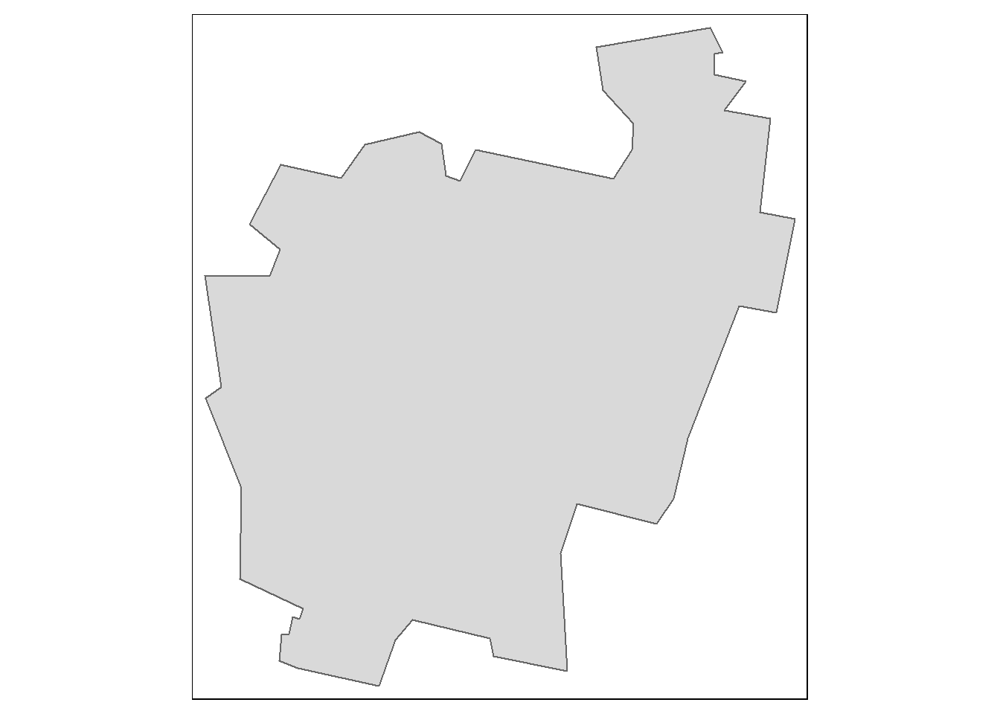

# Vector operations in R{-}

We'll first load spatial objects used in this exercise from a remote website: a polygon object that delineates  Maine counties; another polygon object that delineates distances to Augusta (Maine) as concentric circles; and a line object that shows the highway system that runs through Maine. These data are already stored as R data objects thus eliminating the need for any data conversion.


```r
z <- gzcon(url("http://colby.edu/~mgimond/Spatial/Data/Income_schooling.rds"))
s1 <- readRDS(z)

z <- gzcon(url("http://colby.edu/~mgimond/Spatial/Data/dist.rds"))
s2 <- readRDS(z)

z <- gzcon(url("http://colby.edu/~mgimond/Spatial/Data/highway.rds"))
l1 <- readRDS(z)
```

A map of the above layers is shown below.


```r
library(tmap)

# Get min/max bounding box for both polygon shapes
library(sp)
b1 <- bbox(s1)
b2 <- bbox(s2)
b3 <- pmax(b1,b2)
b3[,1] <- pmin(b1[,1],b2[,1])

# Plot all three features (note the bbox=b3 parameter that ensures that  
# the map extent encompasses all polygon extents)
tm_shape(s1, bbox = b3) + tm_fill(col="grey") + tm_borders(col = "white") +
  tm_shape(s2) + tm_fill(alpha = 0.2, col = "red") + tm_borders(col = "red") +
  tm_shape(l1) + tm_lines(col="yellow")
```


The attributes table for both polygon objects are shown next. Note that each shape object has a unique set of attributes as well as a unique number of records

<div class="figure">

<p class="caption">(\#fig:unnamed-chunk-3)Attribute tables for the Maine spatial object, `s1`, (left table) and the distance to Augusta spatial object, `s2` (right table).</p>
</div>

## Dissolve by contiguous shape {-}

To dissolve all polygons that share at least one line segment, simply pass the object name to `raster`'s `aggregate` function. In this example, we dissolve all polygons to create a single outline of the state of Maine.


```r
library(raster)
ME <- aggregate(s1)
qtm(ME)
```


 
## Dissolve by attribute {-}

First, we'll create a new column whose value is binary (TRUE/FALSE) depending on whether or not the county income is below the counties' median income value.


```r
s1$med <- s1$Income > median(s1$Income)
tm_shape(s1) + tm_fill(col="med") +tm_borders(col = "white")
```


Next, we'll dissolve all polygons by the `med` value. Any polygons sharing at least one line segment having the same `med` value will be dissolved into a single polygon.


```r
ME.inc <- aggregate(s1, by= "med")
tm_shape(ME.inc) + tm_fill(col="med") +tm_borders()
```


The aggregation function will, by default, elliminate all other attribute values. If you wish to summarize other attribute values along with the attribute used for aggregation use `dplyr`'s piping operation. For example, to compute the median `Income` value for each of the below/above median income groups type the following:


To summarize education by below/above median income


```r
library(dplyr)
ME.inc$Income <- s1@data %>% group_by(med) %>%
                          summarize(medinc = median(Income)) %>% .$medinc
tm_shape(ME.inc) + tm_fill(col="Income") +tm_borders()
```


To view the attributes table with both the aggregate variable, `med`, and the median income variable, `Income`, type:


```r
ME.inc@data
```

```
    med Income
1 FALSE  21518
2  TRUE  27955
```


## Calculate area {-}

To calculate a polygon's area, you can use `rgeos`'s `gArea` function. For example, to compute the area in km^2^, type the following:


```r
library(rgeos)
ME.inc$Area <- gArea(ME.inc, byid=TRUE) / 1000000
```

The `gArea` function computes the area in map units which happens to be in meters in our example. To convert the area from m^2^ to km^2^, we simply divide by `1,000,000` in the above chunk of code. This produces the following attributes table.


 

```r
ME.inc@data
```

```
    med Income     Area
1 FALSE  21518 67743.58
2  TRUE  27955 15503.19
```

## Subsetting {-}

You can use conventional R dataframe manipulation operations to subset by attribute values. For example, to subset by county name (e.g. `Kennebec` county), type:


```r
ME.ken <- s1[s1$NAME == "Kennebec",]
qtm(ME.ken)
```



To subset by a range of attribute values (e.g. subset by income values that are less than the median value), type:


```r
ME.inc2 <- s1[s1$Income < median(s1$Income), ]
qtm(ME.inc2)
```


## Intersecting {-}

To intersect two polygon objects, you can use `raster`'s `intersect` function.


```r
library(raster)
clp1 <- intersect(s1,s2)
tm_shape(clp1) + tm_fill(col="Income") +tm_borders()
```


`intersect` keeps all features that overlap along with their combined attributes. Note that new polygons are created which can increase the size of the attributes table beyond the size of the combined input attributes table.


### Intersecting polygons with line and point objects {-}

This method will also intersect line and point objects with a polygon object, but the output will be either a line/point or a polygon depending on the order in which the objects are passed to `intersect`. If the line object is passed first, the output will be a line object that falls within the polygons of the input polygon object. If the polygon object is passed first, then all polygons that have a line segment within their boundaries will be returned. For example:

To output all counties having at least one segment of the line feature running through them, type:


```r
library(raster)
clp2 <- intersect(s1,l1)
tm_shape(clp2) + tm_fill(col="grey") +tm_borders() + 
  tm_shape(l1) + tm_lines(col="red")
```


To output all line segments that fall within the concentric distance circles of `s2`, type:


```r
library(raster)
clp3 <- intersect(l1,s2)
tm_shape(s2) + tm_fill(col="grey") +tm_borders() + 
  tm_shape(clp3) + tm_lines(col="red")
```


In both cases, the output shape objects inherit both the original attribute values as well as the attributes from the intersecting object.

## Unioning {-}

To union two polygon objects, use `raster`'s `union` function. For example,


```r
library(raster)
un1  <- union(s1,s2)
tm_shape(un1) + tm_fill(col="Income") + tm_borders()
```


This produces the following attributes table.
 

