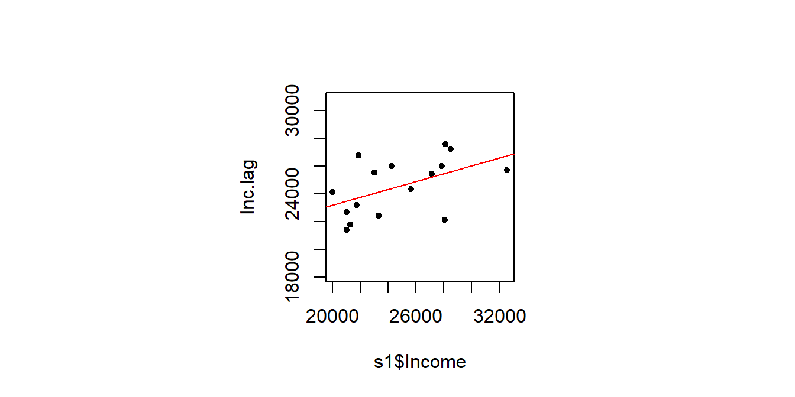
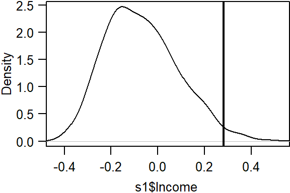
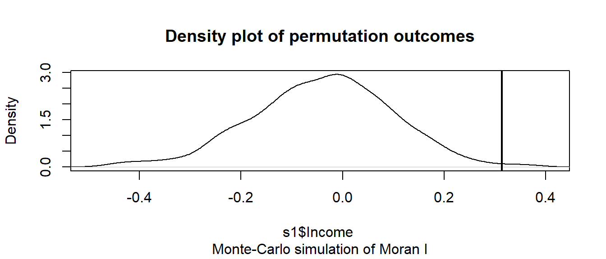

# Spatial Autocorrelation in R {-}

The `spdep` functions used in this exercise make use of different spatial object classes than those used by the `spatstat` package. Here, we'll load layers as `SpatialPolygonsDataFrame` objects. If we were to work with point data instead, we would store the point shapefiles as `SpatialPointsDataFrame`. 

We'll first load the spatial object used in this exercise from a remote website--income and education data aggregated at the county level for the state of Maine. This object will be loaded as a `SpatialPolygonsDataFrame` and will therefore not require conversion.


```r
z <- gzcon(url("http://colby.edu/~mgimond/Spatial/Data/Income_schooling.rds"))
s1 <- readRDS(z)
```

The spatial object has five attributes. The one of interest for this exercise is `Income` (per capita, in dollars).


Let's map the income distribution using a quantile classification scheme.


```r
library(tmap)
tm_shape(s1) + tm_polygons(style="quantile", col = "Income") +
  tm_legend(outside = TRUE, text.size = .8) 
```


## Define neighboring polygons {-}

The first step requires that we define "neighboring" polygons. This could refer to contiguous polygons, polygons within a certain distance band, or it could be non-spatial in nature and defined by social, political or cultural "neighbors".

Here, we'll adopt a contiguous neighbor definition where we'll accept any contiguous polygon that shares at least on vertex (this is the "queen" case and is defined by setting the parameter `queen=TRUE`). If we required that at least one *edge* be shared between polygons then we would set `queen=FALSE`.


```r
library(spdep)
nb <- poly2nb(s1, queen=TRUE)
```

For each polygon in our polygon object, `nb` lists all neighboring polygons. For example, to see the neighbors for the first polygon in the object, type:


```r
nb[1]
```

```
[[1]]
[1] 2 3 4 5
```

Polygon `1` has 4 neighbors. The first polygon is associated with the attribute name `Aroostook`:


```r
s1$NAME[1]
```

```
[1] Aroostook
16 Levels: Androscoggin Aroostook Cumberland Franklin Hancock ... York
```

The four neighboring polygons are associated with the names:


```r
s1$NAME[c(2,3,4,5)]
```

```
[1] Somerset    Piscataquis Penobscot   Washington 
16 Levels: Androscoggin Aroostook Cumberland Franklin Hancock ... York
```
Next, we need to assign weights to each neighboring polygon. In our case, each polygon will be assigned equal weight when computing the neighboring mean values.


```r
lw <- nb2listw(nb, style="W", zero.policy=TRUE)
```

To see the weight of the first polygon's four neighbors type:

```r
lw$weights[1]
```

```
[[1]]
[1] 0.25 0.25 0.25 0.25
```

Each neighbor is assigned a quarter of the total weight. This means that when R computes the average neighboring income values, each neighbor's income will be multiplied by `0.25` before being tallied.

Finally, we'll compute the average neighbor income value for each polygon. These values are often referred to as **spatially lagged** values.


```r
Inc.lag <- lag.listw(lw, s1$Income)
```

The following table shows the average neighboring income values (stored in the `Inc.lag` object) for each county.


## Computing the Moran's I statistic: the hard way {-}

We can plot *lagged income* vs. *income* and fit a linear regression model to the data.


```r
# Create a regression model
M <- lm(Inc.lag ~ s1$Income)

# Plot the data
OP <- par(pty="s")  # Force a square plot
 plot( Inc.lag ~ s1$Income, pch=20, asp=1)
 abline(M, col="red") # Add the regression line from model M
par(OP) # Revert back to default plot settings
```



The slope of the regression line is the Moran's I coefficient


```r
coef(M)[2]
```

```
s1$Income 
0.2828111 
```

To assess if the slope is significantly different from zero, we can *randomly* permute the income values (i.e. we are not imposing any spatial autocorrelation) across all counties then fit a regression model to each permuted set of values.  We then tally the slope values and compare our observed slope (i.e. the Moran's I value) to the distribution of Moran's I values from the simulation.


```r
n <- 599   # Define the number of simulations
I.r <- vector()  # Create an empty vector

for (i in 1:n){
  # Randomly shuffle income values
  x <- sample(s1$Income, replace=FALSE)
  # Compute new set of lagged values
  x.lag <- lag.listw(lw, x)
  # Compute the regression slope
  M.r <- lm(x.lag ~ x)
  I.r[i] <- coef(M.r)[2]
}

# Plot histogram of simulated Moran's I values
# then add our observed Moran's I value to the plot
hist(I.r, main=NULL)
abline(v=coef(M)[2], col="red")
par(OP)
```


The simulation suggests that our observed Moran's I value is not consistent with a Moran's I value one would expect to get if the income values were not spatially correlated. In the next step, we'll compute a pseudo p-value.

### Computing a pseudo p-value from an MC simulation {-}

First, we need to find the number of simulated ANN values greater than our observed ANN value


```r
N.greater <- sum(coef(M)[2] > I.r)
```

To compute the p-value, find the end of the distribution closest to the observed ANN value, then divide that count by the total count. Note that this is a so-called one-side P-value. See lecture notes for more information.


```r
p <- min(N.greater + 1, n + 1 - N.greater) / (n + 1)
p
```

```
[1] 0.015
```

In our working example, the p-value suggests that there is a small chance (~ 2%) of being wrong in stating that the income values are not clustered at the county level.

## Computing the Moran's I statistic: the easy way {-}

To get the Moran's I value, simply use the `moran.test` function.


```r
moran.test(s1$Income,lw)
```

```

	Moran I test under randomisation

data:  s1$Income  
weights: lw    

Moran I statistic standard deviate = 2.2472, p-value = 0.01231
alternative hypothesis: greater
sample estimates:
Moran I statistic       Expectation          Variance 
       0.28281108       -0.06666667        0.02418480 
```

Note that the p-value computed from the `moran.test` function is not computed from an MC silumation but *analytically* instead. This may not always prove to be the most accurate measure of significance. To test for significance using the *MC simulation* method instead, use the `moran.mc` function.


```r
MC<- moran.mc(s1$Income, lw, nsim=599)

# View results (including p-value)
MC
```

```

	Monte-Carlo simulation of Moran I

data:  s1$Income 
weights: lw  
number of simulations + 1: 600 

statistic = 0.28281, observed rank = 589, p-value = 0.01833
alternative hypothesis: greater
```

```r
# Plot the distribution (note that this is a density plot instead of a histogram)
plot(MC, main=NULL)
```



## Moran's I as a function of a distance band {-}

In this section, we will explore spatial autocorrelation as a function of distance bands. 

Instead of defining neighbors as contiguous polygons, we will define neighbors based on distances to polygon centers. We therefore need to extract the center of each polygon


```r
coo <- coordinates(s1)
```

The object `coo` stores all sixteen pairs of coordinate values. 

Next, we will define the search radius to include all neighboring polygon centers within 50 km (or 50,000 meters)


```r
S.dist  <-  dnearneigh(coo, 0, 50000)  
```

The `dnearneigh` function takes on three parameters: the coordinate values `coo`, the radius for the inner radius of the annulus band, and the radius for the outer  annulus band. In our example, the inner annulus radius is `0` which implies that all polygon centers up to  50km are considered neighbors. 

Note that if we chose to restrict the neighbors to all polygon centers between 50 km and 100 km, then we would define a search annulus (instead of a circle) as `dnearneigh(coo, 50000, 100000)`.

Now that we defined our search circle, we need to identify all neighboring polygons for each polygon in the dataset.


```r
lw <- nb2listw(S.dist, style="W",zero.policy=T) 
```

Run the MC simulation.


```r
MI  <-  moran.mc(s1$Income, lw, nsim=599,zero.policy=T) 
```

Plot the results.


```r
plot(MI) 
```



Display p-value and other summary statistics.


```r
MI
```

```

	Monte-Carlo simulation of Moran I

data:  s1$Income 
weights: lw  
number of simulations + 1: 600 

statistic = 0.31361, observed rank = 596, p-value = 0.006667
alternative hypothesis: greater
```

