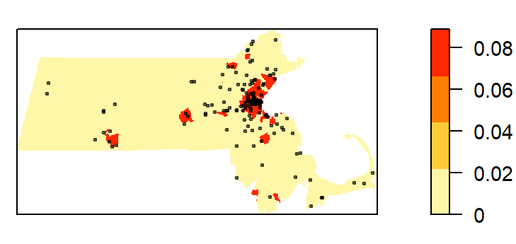
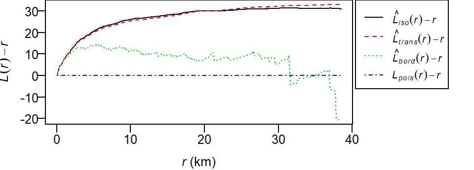
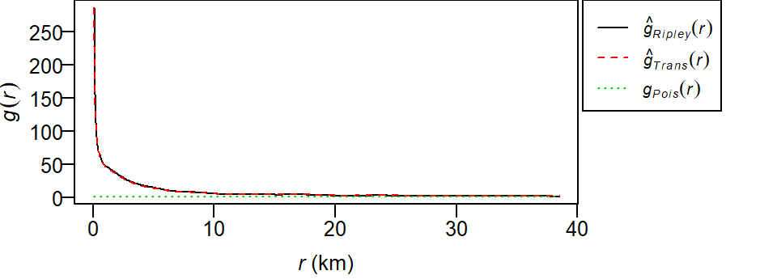
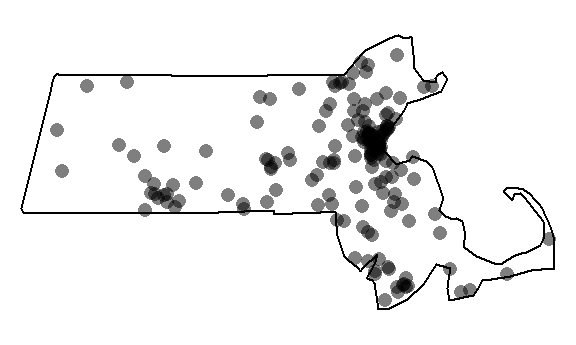
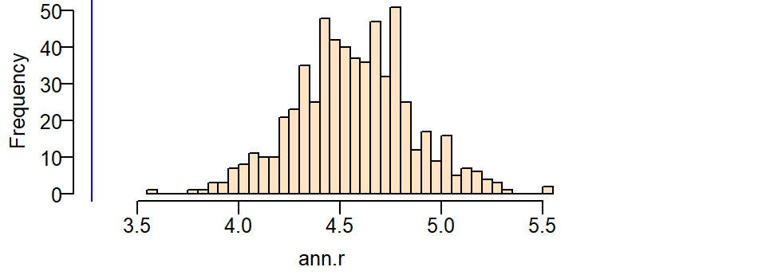

# Point pattern analysis in R {-}

For a basic theoretical treatise on point pattern analysis (PPA) the reader is encouraged to review the [point pattern analysis lecture notes](https://mgimond.github.io/Spatial/point-pattern-analysis.html). This section is intended to supplement the lecture notes by implementing PPA techniques in the R programming environment.

## Sample files for this exercise {-#pppR1}

Data used in the following exercises can be loaded into your current R session by running the following chunk of code.


```r
load(url("http://github.com/mgimond/Spatial/raw/master/Data/ppa.RData"))
```

The data objects consist of three spatial data layers: 

* `starbucks`: A `ppp` point layer of Starbucks stores in Massachusetts;  
* `ma`: An `owin` polygon layer of Massachusetts boundaries;
* `pop`: An `im` raster layer of population density distribution. 

All layers are in a format supported by the `spatstat` [@Spatstat] package. Note that these layers are not authoritative and are to be used for instructional purposes only.

## Getting external data into a `spatstat` format {-#pppR2}

The [first appendix](https://mgimond.github.io/Spatial/reading-and-writing-spatial-data-in-r.html#converting-an-sf-point-object-to-a-ppp-object) steps you through the process of loading external data into R. But in summary, if you had layers stored as shapefile and raster file formats, you could import the data using the following example:


```
library(rgdal)
library(maptools)
library(raster)

# Load an MA.shp polygon shapefile 
s    <- readOGR(".", "MA")  # Don't add the .shp extension
ma    <- as(s, "owin") 

# Load a starbucks.shp point feature shapefile
s  <- readOGR(".","starbucks")  # Don't add the .shp extension
starbucks    <- as(s, "ppp")

# Load a pop_sqmile.img population density raster layer
img  <- raster("pop_sqmile.img")
pop  <- as.im(img)
```

## Prepping the data {-#pppR3}

All point pattern analysis tools used in this tutorial are available in the `spatstat` package. These tools are designed to work with points stored as `ppp` objects and *not* `SpatialPointsDataFrame` or `sf` objects. Note that a `ppp` object may or may not have attribute information (also referred to as *marks*). Knowing whether or not a function requires that an attribute table be present in the `ppp` object matters if the operation is to complete successfully. In this tutorial we will only concern ourselves with the pattern generated by the points and not their attributes. We'll therefore remove all marks from the point object.


```r
library(spatstat)
marks(starbucks)  <- NULL
```

Many point pattern analyses such as the average nearest neighbor analysis should have their study boundaries  explicitly defined. This can be done in `spatstat` by "binding" the Massachusetts boundary polygon to the Starbucks point feature object using the `Window()` function. Note that the function name starts with an upper case `W`.


```r
Window(starbucks) <- ma
```

We can plot the point layer to ensure that the boundary is properly defined for that layer.


```r
plot(starbucks, main=NULL, cols=rgb(0,0,0,.2), pch=20)
```


We'll make another change to the dataset. Population density values for an administrative layer are usually quite skewed. The population density for Massachusetts is no exception. The following code chunk generates a histogram from the `pop` raster layer.


```r
hist(pop, main=NULL, las=1)
```


Transforming the skewed distribution in the population density covariate may help reveal relationships between point distributions and the covariate in some of the point pattern analyses covered later in this tutorial. We'll therefore create a log-transformed version of `pop`.


```r
pop.lg <- log(pop)
hist(pop.lg, main=NULL, las=1)
```


We'll be making use of both expressions of the population density distribution in the following exercises.

## Density based analysis {-#pppR4}

### Quadrat density {-#pppR5}

You can compute the quadrat count and intensity using spatstat's `quadratcount()` and `intensity()` functions.  The following code chunk divides the state of Massachusetts into a grid of 3 rows and 6 columns then tallies the number of points falling in each quadrat.


```r
Q <- quadratcount(starbucks, nx= 6, ny=3)
```

The object `Q` stores the number of points inside each quadrat. You can plot the quadrats along with the **counts** as follows:


```r
plot(starbucks, pch=20, cols="grey70", main=NULL)  # Plot points
plot(Q, add=TRUE)  # Add quadrat grid
```


You can compute the **density** of points within each quadrat as follows:


```r
# Compute the density for each quadrat
Q.d <- intensity(Q)

# Plot the density
plot(intensity(Q, image=TRUE), main=NULL, las=1)  # Plot density raster
plot(starbucks, pch=20, cex=0.6, col=rgb(0,0,0,.5), add=TRUE)  # Add points
```


The density values are reported as the number of points (stores) per square meters, per quadrat. The *Length* dimension unit is extracted from the coordinate system associated with the point layer. In this example, the length unit is in meters, so the density is reported as points per square meter. Such a small length unit is not practical at this scale of analysis. It's therefore desirable to rescale the spatial objects to a larger length unit such as the **kilometer**.


```r
starbucks.km <- rescale(starbucks, 1000, "km")
ma.km <- rescale(ma, 1000, "km")
pop.km    <- rescale(pop, 1000, "km")
pop.lg.km <- rescale(pop.lg, 1000, "km")
```

The second argument to the `rescale` function divides the current unit (meter) to get the new unit (kilometer). This gives us more sensible density values to work with.


```r
# Compute the density for each quadrat (in counts per km2)
Q   <- quadratcount(starbucks.km, nx= 6, ny=3)
Q.d <- intensity(Q)

# Plot the density
plot(intensity(Q, image=TRUE), main=NULL, las=1)  # Plot density raster
plot(starbucks.km, pch=20, cex=0.6, col=rgb(0,0,0,.5), add=TRUE)  # Add points
```


### Quadrat density on a tessellated surface {-#pppR6}

We can use a covariate such as the population density raster to define non-uniform quadrats.

We'll first divide the population density covariate into four regions (aka tessellated surfaces) following an equal interval classification scheme. Recall that we are working with the log transformed population density values. The breaks will be defined as follows:

+-------+---------------------------------+
| Break | Logged population density value |
+=======+=================================+
| 1     |  `] -Inf; 4 ]`                  |
+-------+---------------------------------+
| 2     | `]  4  ; 6 ]`                   |
+---------------+-------------------------+
| 3     | `]  3  ; 8 ]`                   |
+---------------+-------------------------+
| 4     | `]  8  ; Inf ]`                 |
+---------------+-------------------------+


```r
brk  <- c( -Inf, 4, 6, 8 , Inf)  # Define the breaks
Zcut <- cut(pop.lg.km, breaks=brk, labels=1:4)  # Classify the raster
E    <- tess(image=Zcut)  # Create a tesselated surface
```

The tessellated object can be mapped to view the spatial distribution of quadrats.


```r
plot(E, main="", las=1)
```


Next, we'll tally the quadrat counts within each tessellated area then compute their density values (number of points per quadrat area).


```r
Q   <- quadratcount(starbucks.km, tess = E)  # Tally counts
Q.d <- intensity(Q)  # Compute density
Q.d
```

```
tile
           1            2            3            4 
0.0000000000 0.0003706106 0.0103132964 0.0889370933 
```

Recall that the length unit is kilometer so the above density values are number of points per square kilometer within each quadrat unit.

Plot the density values across each tessellated region.


```r
plot(intensity(Q, image=TRUE), las=1, main=NULL)
plot(starbucks.km, pch=20, cex=0.6, col=rgb(1,1,1,.5), add=TRUE)
```


Let's modify the color scheme.


```r
cl <-  interp.colours(c("lightyellow", "orange" ,"red"), E$n)
plot( intensity(Q, image=TRUE), las=1, col=cl, main=NULL)
plot(starbucks.km, pch=20, cex=0.6, col=rgb(0,0,0,.5), add=TRUE)
```



### Kernel density raster {-#pppR7}

The spatstat package has a function called `density` which computes an isotropic kernel intensity estimate of the point pattern. Its bandwidth defines the kernel's window extent.

This next code chunk uses the default bandwidth.


```r
K1 <- density(starbucks.km) # Using the default bandwidth
plot(K1, main=NULL, las=1)
contour(K1, add=TRUE)
```


In this next chunk, a 50 km bandwidth (`sigma = 50`) is used. Note that the length unit is extracted from the point layer's mapping units (which was rescaled to kilometers earlier in this exercise). 


```r
K2 <- density(starbucks.km, sigma=50) # Using a 50km bandwidth
plot(K2, main=NULL, las=1)
contour(K2, add=TRUE)
```


The kernel defaults to a gaussian smoothing function. The smoothing function can be changed to a `quartic`, `disc` or `epanechnikov` function. For example, to change the kernel to a `disc` function type:


```r
K3 <- density(starbucks.km, kernel = "disc", sigma=50) # Using a 50km bandwidth
plot(K3, main=NULL, las=1)
contour(K3, add=TRUE)
```


### Kernel density adjusted for covariate {-#pppR8}

In the following example, a Starbucks store point process' intensity is estimated following the population density raster covariate. The outputs include a plot of $\rho$ vs. population density and a raster map of $\rho$ controlled for population density.


```r
# Compute rho using the ratio method
rho <- rhohat(starbucks.km, pop.lg.km,  method="ratio")
# Generate rho vs covariate plot
plot(rho, las=1, main=NULL, legendargs=list(cex=0.8, xpd=TRUE, inset=c(1.01, 0) ))
```


It's important to note that we are not fitting a parametric model to the data. Instead, a non-parametric curve is fit to the data. Its purpose is to describe/explore the shape of the relationship between point density and covariate.  Note the exponentially increasing inensity of Starbucks stores with increasing population density values when the population density is expressed as a log. The grey envelope represents the 95% confidence interval.

The following code chunk generates the map of the predicted Starbucks density if population density were the sole driving process. (Note the use of the `gamma` parameter to "stretch" the color scheme in the map).


```r
pred <- predict(rho)
cl   <- interp.colours(c("lightyellow", "orange" ,"red"), 100) # Create color scheme
plot(pred, col=cl, las=1, main=NULL, gamma = 0.25)
```


The predicted intensity's spatial pattern mirrors the covariate's population distribution pattern. The predicted intensity values range from 0 to about 5 stores per square kilometer. You'll note that this maximum value does not match the maximum value of ~3 shown in the `rho` vs population density plot. This is because the plot did not show the full range of population density values (the max density value shown was 10). The population raster layer has a maximum pixel value of 11.03 (this value can be extracted via `max(pop.lg.km)`).

We can compare the output of the predicted Starbucks stores intensity function to that of the observed Starbucks stores intensity function. We'll use the variable `K1` computed earlier to represent the observed intensity function.


```r
K1_vs_pred <- pairs(K1, pred, plot = FALSE)
plot(K1_vs_pred$pred ~ K1_vs_pred$K1, pch=20,
     xlab = "Observed intensity", 
     ylab = "Predicted intensity", 
     col = rgb(0,0,0,0.1))
```


If the modeled intensity was comparable to the observed intensity, we would expect the points to cluster along a one-to-one diagonal. An extreme example is to compare the observed intensity with itself which offers a perfect match of intensity values.


```r
K1_vs_K1 <- pairs(K1, K1, labels = c("K1a", "K1b"), plot = FALSE)
plot(K1_vs_K1$K1a ~ K1_vs_K1$K1b, pch=20,
     xlab = "Observed intensity", 
     ylab = "Observed intensity")
```


So going back to our predicted vs observed intensity plot, we note a strong skew in the predicted intensity values. We also note an overestimation of intensity around higher values.


```r
summary(as.data.frame(K1_vs_pred))
```

```
       K1                 pred         
 Min.   :4.027e-05   Min.   :0.000000  
 1st Qu.:9.564e-04   1st Qu.:0.000282  
 Median :2.317e-03   Median :0.001541  
 Mean   :6.488e-03   Mean   :0.007821  
 3rd Qu.:7.865e-03   3rd Qu.:0.005904  
 Max.   :4.303e-02   Max.   :5.101111  
```
The predicted maximum intensity value is two orders of magnitude greater than that observed.

The overestimation of intenstity values can also be observed at lower values. The following plot limits the data to observed intensities less than 0.04. A red one-to-one line is added for reference. If intensities were similar, they would aggregate around this line.


```r
plot(K1_vs_pred$pred ~ K1_vs_pred$K1, pch=20,
     xlab = "Observed intensity", 
     ylab = "Predicted intensity", 
     col = rgb(0,0,0,0.1),
     xlim = c(0, 0.04), ylim = c(0, 0.1))
abline(a=0, b = 1, col = "red")
```


### Modeling intensity as a function of a covariate {-#pppR9}

The relationship between the predicted Starbucks store point pattern intensity and the population density distribution can be modeled following a Poisson point process model. We'll generate the Poisson point process model then plot the results. 


```r
# Create the Poisson point process model
PPM1 <- ppm(starbucks.km ~ pop.lg.km)
# Plot the relationship
plot(effectfun(PPM1, "pop.lg.km", se.fit=TRUE), main=NULL, 
     las=1, legendargs=list(cex=0.8, xpd=TRUE, inset=c(1.01, 0) ))
```


Note that this is not the same relationship as  $\rho$ vs. population density shown in the previous section. Here, we're fitting a well defined model to the data whose parameters can be extracted from the `PPM1` object.


```r
PPM1
```

```
Nonstationary Poisson process

Log intensity:  ~pop.lg.km

Fitted trend coefficients:
(Intercept)   pop.lg.km 
 -13.710551    1.279928 

              Estimate       S.E.    CI95.lo    CI95.hi Ztest      Zval
(Intercept) -13.710551 0.46745489 -14.626746 -12.794356   *** -29.33021
pop.lg.km     1.279928 0.05626785   1.169645   1.390211   ***  22.74705
Problem:
 Values of the covariate 'pop.lg.km' were NA or undefined at 0.57% (4 out of 
699) of the quadrature points
```

The model takes on the form:

$$
\lambda(i) = e^{-13.71 + 1.27(logged\ population\ density)}
$$

Here, the base intensity is close to zero ($e^{-13.71}$) when the logged population density is zero and for every increase in one unit of the logged population density, the Starbucks point density increases by $e^{1.27}$ units.

## Distance based analysis {-#pppR10}

Next, we'll explore three different distance based analyses: The average nearest neighbor, the $K$ and $L$ functions and the pair correlation function $g$.

### Average nearest neighbor analysis {-#pppR11}

Next, we'll compute the average nearest neighbor (ANN) distances between Starbucks stores.

To compute the average **first** nearest neighbor distance (in kilometers) set `k=1`:


```r
mean(nndist(starbucks.km, k=1))
```

```
[1] 3.275492
```

To compute the average **second** nearest neighbor distance set `k=2`:


```r
mean(nndist(starbucks.km, k=2))
```

```
[1] 5.81173
```

The parameter `k` can take on any order neighbor (up to `n-1` where n is the total number of points).

The average nearest neighbor function can be expended to generate an ANN vs neighbor order plot. In the following example, we'll plot ANN as a function of neighbor order for the first 100 closest neighbors:


```r
ANN <- apply(nndist(starbucks.km, k=1:100),2,FUN=mean)
plot(ANN ~ eval(1:100), type="b", main=NULL, las=1)
```



The bottom axis shows the neighbor order number and the left axis shows the average distance in kilometers.

### K and L functions {-#pppR12}

To compute the K function, type:


```r
K <- Kest(starbucks.km)
plot(K, main=NULL, las=1, legendargs=list(cex=0.8, xpd=TRUE, inset=c(1.01, 0) ))
```



The plot returns different estimates of $K$ depending on the edge correction chosen. By default, the `isotropic`, `translate` and `border`  corrections are implemented. To learn more about these edge correction methods type `?Kest` at the command line. The estimated $K$ functions are listed with a hat `^`. The black line ($K_{pois}$) represents the theoretical $K$ function under the null hypothesis that the points are completely randomly distributed (CSR/IRP). Where $K$ falls under the theoretical $K_{pois}$ line the points are deemed more dispersed than expected at distance $r$. Where $K$ falls above the theoretical $K_{pois}$ line the points are deemed more clustered than expected at distance $r$.

To compute the L function, type:


```r
L <- Lest(starbucks.km, main=NULL)
plot(L, main=NULL, las=1, legendargs=list(cex=0.8, xpd=TRUE, inset=c(1.01, 0) ))
```


To plot the L function with the L~expected~ line set horizontal:


```r
plot(L, . -r ~ r, main=NULL, las=1, legendargs=list(cex=0.8, xpd=TRUE, inset=c(1.01, 0) ))
```


### Pair correlation function g {-#pppR13}

To compute the pair correlation function type:


```r
g  <- pcf(starbucks.km)
plot(g, main=NULL, las=1, legendargs=list(cex=0.8, xpd=TRUE, inset=c(1.01, 0) ))
```


As with the `Kest` and `Lest` functions, the `pcf` function outputs different estimates of $g$ using different edge correction methods (`Ripley` and `Translate`). The theoretical $g$-function $g_{Pois}$  under a CSR process (green dashed line) is also displayed for comparison. Where the observed $g$ is greater than $g_{Pois}$ we can expect more clustering than expected and where the observed $g$ is less than $g_{Pois}$ we can expect more dispersion than expected.

## Hypothesis tests {-#pppR14}


### Test for clustering/dispersion {-#pppR15}

First, we'll run an ANN analysis for Starbucks locations assuming a uniform point density across the state (i.e. a completely spatially random process).


```r
ann.p <- mean(nndist(starbucks.km, k=1))
ann.p
```

```
[1] 3.275492
```

The observed average nearest neighbor distance is 3.28 km. 

Next, we will generate the distribution of expected ANN values given a homogeneous (CSR/IRP) point process using Monte Carlo methods. This is our null model.


```r
n     <- 599L               # Number of simulations
ann.r <- vector(length = n) # Create an empty object to be used to store simulated ANN values
for (i in 1:n){
  rand.p   <- rpoint(n=starbucks.km$n, win=ma.km)  # Generate random point locations
  ann.r[i] <- mean(nndist(rand.p, k=1))  # Tally the ANN values
}
```

In the above loop, the function `rpoint` is passed two parameters: `n=starbucks.km$n` and  `win=ma.km`. The first tells the function how many points to randomly generate (`starbucks.km$n` extracts the number of points from object `starbucks.km`). The second tells the function to confine the points to the extent defined by `ma.km`. Note that the latter parameter is not necessary if the `ma` boundary was already defined as the `starbucks` window extent.

You can plot the last realization of the homogeneous point process to see what a completely random placement of Starbucks stores could look like.


```r
plot(rand.p, pch=16, main=NULL, cols=rgb(0,0,0,0.5))
```



Our observed distribution of Starbucks stores certainly does not look like the outcome of a completely independent random process.

Next, let's plot the histogram of expected values under the null and add a blue vertical line showing where our observed ANN value lies relative to this distribution.


```r
hist(ann.r, main=NULL, las=1, breaks=40, col="bisque", xlim=range(ann.p, ann.r))
abline(v=ann.p, col="blue")
```



It's obvious from the test that the observed ANN value is far smaller than the expected ANN values one could expect under the null hypothesis. A smaller observed value indicates that the stores are far more clustered than expected under the null. 

Next, we'll run the same test but control for the influence due to population density distribution. Recall that the ANN analysis explores the 2^nd^ order process underlying a point pattern thus requiring that we control for the first order process (e.g. population density distribution). This is a non-homogeneous test. Here, we pass the parameter `f=pop.km` to the function `rpoint` telling it that the population density raster `pop.km` should be used to define where a point should be most likely placed (high population density) and least likely placed (low population density) under this new null model. Here, we'll use the non-transformed representation of the population density raster, `pop.km`.


```r
n     <- 599L
ann.r <- vector(length=n)
for (i in 1:n){
  rand.p   <- rpoint(n=starbucks.km$n, f=pop.km) 
  ann.r[i] <- mean(nndist(rand.p, k=1))
}
```

You can plot the last realization of the non-homogeneous point process to convince yourself that the simulation correctly incorporated the covariate raster in its random point function.


```r
Window(rand.p) <- ma.km  # Replace raster mask with ma.km window
plot(rand.p, pch=16, main=NULL, cols=rgb(0,0,0,0.5))
```


Note the cluster of points near the highly populated areas. This pattern is different from the one generated from a completely random process. 

Next, let's plot the histogram and add a blue line showing where our observed ANN value lies.


```r
hist(ann.r, main=NULL, las=1, breaks=40, col="bisque", xlim=range(ann.p, ann.r))
abline(v=ann.p, col="blue")
```


Even though the distribution of ANN values we could expect when controlled for the population density nudges closer to our observed ANN value, we still cannot say that the clustering of Starbucks stores can be explained by population density alone.

### Computing a pseudo p-value from the simulation {-#pppR16}

A (pseudo) p-value can be extracted from a Monte Carlo simulation. We'll work off of the last simulation. First, we need to find the number of simulated ANN values greater than our observed ANN value.


```r
N.greater <- sum(ann.r > ann.p)
```

To compute the p-value, find the end of the distribution closest to the observed ANN value, then divide that count by the total count. Note that this is a so-called one-sided P-value. See lecture notes for more information.


```r
p <- min(N.greater + 1, n + 1 - N.greater) / (n +1)
p
```

```
[1] 0.001666667
```

In our working example, you'll note that or simulated ANN value was nowhere near the range of ANN values computed under the null yet we don't have a p-value of zero. This is by design since the *strength* of our estimated p will be proportional to the number of simulations--this reflects the chance that given an infinite number of simulations at least one *realization* of a point pattern could produce an ANN value more extreme than ours.


### Test for a poisson point process model with a covariate effect {-#pppR17}

The ANN analysis addresses the 2~nd~ order effect of a point process. Here, we'll address the 1~st~ order process using the poisson point process model. 

We'll first fit a model that assumes that the point process' intensity *is* a function of the logged population density (this will be our alternate hypothesis).


```r
PPM1 <- ppm(starbucks.km ~ pop.lg.km)
PPM1
```

```
Nonstationary Poisson process

Log intensity:  ~pop.lg.km

Fitted trend coefficients:
(Intercept)   pop.lg.km 
 -13.710551    1.279928 

              Estimate       S.E.    CI95.lo    CI95.hi Ztest      Zval
(Intercept) -13.710551 0.46745489 -14.626746 -12.794356   *** -29.33021
pop.lg.km     1.279928 0.05626785   1.169645   1.390211   ***  22.74705
Problem:
 Values of the covariate 'pop.lg.km' were NA or undefined at 0.57% (4 out of 
699) of the quadrature points
```

Next, we'll fit the model that assumes that the process' intensity is *not* a function of population density (the null hypothesis).


```r
PPM0 <- ppm(starbucks.km ~ 1)
PPM0
```

```
Stationary Poisson process
Intensity: 0.008268627
             Estimate       S.E.   CI95.lo   CI95.hi Ztest      Zval
log(lambda) -4.795287 0.07647191 -4.945169 -4.645405   *** -62.70651
```

In our working example, the null model (homogeneous intensity) takes on the form:

$$
\lambda(i) = e^{-4.795}
$$

$\lambda(i)$ under the null is nothing more than the observed density of Starbucks stores within the State of Massachusetts, or:


```r
starbucks.km$n / area(ma.km) 
```

```
[1] 0.008268627
```

The alternate model takes on the form:

$$
\lambda(i) = e^{-13.71 + 1.27\ (logged\ population\ density)}
$$

The models are then compared using the **likelihood ratio test** which produces the following output:


```r
anova(PPM0, PPM1, test="LRT")
```


| Npar| Df| Deviance| Pr(>Chi)|
|----:|--:|--------:|--------:|
|    5| NA|       NA|       NA|
|    6|  1|  537.218|        0|

The value under the heading `PR(>Chi)` is the p-value which gives us the probability that we would be wrong in rejecting the null. Here p~0 suggests that there is close to a 0% chance that we would be wrong in rejecting the base model in favor of the alternate model--put another way, the alternate model (that the logged population density can help explain the distribution of Starbucks stores) is a significant improvement over the null. 

Note that if you were to compare two competing non-homogeneous models such as population density and income distributions, you would need to compare the model with one of the covariates with an augmented version of that model using the other covariate. In other words, you would need to compare `PPM1 <- ppm(starbucks.km ~ pop.lg.km)` with something like  `PPM2 <- ppm(starbucks.km ~ pop.lg.km + income.km)`.
