# Point pattern analysis in R {-}

Most point pattern analysis tools are available in the `spatstat` package. These tools are designed to work with points stored as `ppp` objects and *not* `SpatialPointsDataFrame` objects. A `ppp` may or may not have attribute information (also referred to as *marks*). Knowing whether or not a function requires that an attributes table be present in the `ppp` object matters if a the operation is to complete successfully. 

In the following chunk of code, a point feature of Starbucks stores in Massachusetts is downloaded from the website as a `SpatialPointsDataFrame` then converted to a `ppp` object. Converting a `SpatialPointsDataFrame` to a `ppp` requires the use of the `maptools` package.  Note the intermediate step that strips the point object of a dataframe (attributes table) before being converted to a mark free `ppp` object. 


```r
library(maptools)

z <- gzcon(url("http://colby.edu/~mgimond/Spatial/Data/starbucks.rds"))
S1 <- readRDS(z)
SP <- as(S1, "SpatialPoints")
p2  <- as(SP, "ppp")
```

We will also load a polygon outline of the state of Massachusetts. It will be used to define the extent of the study area (this is needed for hypothesis testing later in this tutorial). It too must be converted to a `spatstat` readable format. We'll convert it to an `owin` object.


```r
z <- gzcon(url("http://colby.edu/~mgimond/Spatial/Data/ma.rds"))
S2 <- readRDS(z)
W  <- as(S2, "owin")
```

Some `spatstat` applications make use of rasters which must be stored as an `im` object. The following chunk of code downloads a raster of Massachusetts population density.


```r
library(spatstat)  # Needed for function as.im()

z <- gzcon(url("http://colby.edu/~mgimond/Spatial/Data/pop_sqmile.rds"))
r <- readRDS(z)
pop <- as.im(r)  # Convert r object to an im object
```

The above datasets will be used later in this tutorial.

Note that `im` objects created by `spatstat` can be converted to a raster object using the `raster()` function from the `raster` package. This can be helpful if you wish to use a mapping application such as `tmap` to map the rasters instead of the base plotting function.

## Density based analysis {-}

### Quadrat density {-}

You can compute the quadrat count and intensity using spatstat's `quadratcount()` and `intensity()` functions. We'll use a built-in dataset for this example.


```r
library(spatstat)
P <- bei
Q <- quadratcount(P, nx= 6, ny=3)
```

The object `Q` stores the number of points inside each quadrat. You can plot the quadrats along with the counts as follows:


```r
plot(P, pch=20, cols="grey70", main=NULL)
plot(Q, add=TRUE)
```

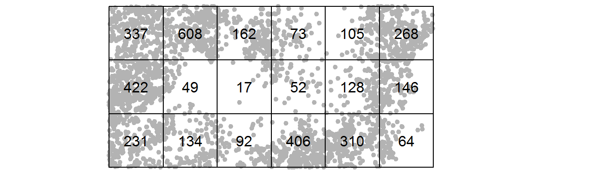

You can compute the density of points within each quadrat as follows:


```r
# Compute the density for each quadrat
Q.d <- intensity(Q)

# Plot the density
plot( intensity(Q, image=TRUE), main=NULL)
plot(P, pch=20, cex=0.6, col=rgb(0,0,0,.2), add=TRUE)
```

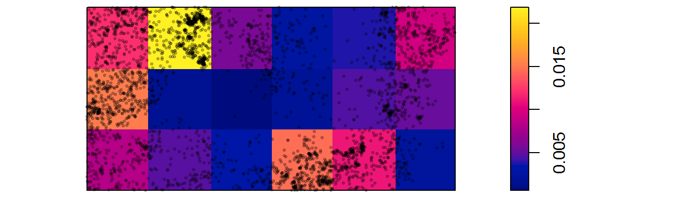


### Quadrat density on a tesselated surface {-}

We'll work off of an internal dataset.


```r
library(spatstat)
P    <- bei              # Use built-in point dataset
elev <- bei.extra$elev   # Use built-in covariate
```

Next, we'll divide the covariate into regions (aka tesselated surfaces).


```r
brk  <- c( 110, 135, 145, 155 , 160)
Zcut <- cut(elev, breaks=brk, labels=1:4)
E    <- tess(image=Zcut)
```

Next, compute the quadrat counts within each tesselated area then compute the density.


```r
Q <- quadratcount(P, tess = E)
Q.d <- intensity(Q)
Q.d
```

```
tile
          1           2           3           4 
0.003219228 0.007573599 0.009870740 0.001859664 
```

Plot the density values across each tesselated region.


```r
plot( intensity(Q, image=TRUE), main=NULL)
plot(P, pch=20, cex=0.6, col=rgb(0,0,0,.2), add=TRUE)
```


Let's modify the color scheme.


```r
cl <-  interp.colours(c("lightyellow", "orange" ,"red"), E$n)
plot( intensity(Q, image=TRUE), col=cl, main=NULL)
plot(P, pch=20, cex=0.6, col=rgb(0,0,0,.2), add=TRUE)
```

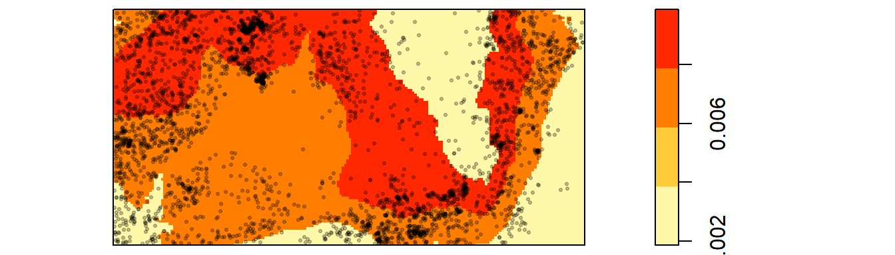

### Kernel density raster {-}

The spatstat package has a function called `density` which implements a gaussian kernel function. Its bandwidth defines the kernel's  window extent.


```r
library(spatstat)
P <- bei    

# Using the default bandwidth
K1 <- density(P)
plot(K1, main=NULL)
contour(K1, add=TRUE)
```

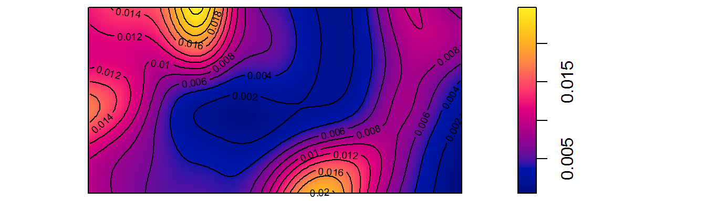

```r
# Using a custom (smaller) bandwidth of 40 map units
K2 <- density(P, sigma=40)
plot(K2, main=NULL)
contour(K2, add=TRUE)
```

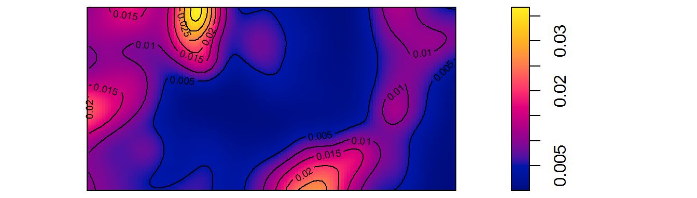

```r
# Using a custom (larger) bandwidth of 50 map units
K3 <- density(P, sigma=500)
plot(K3, main=NULL)
contour(K3, add=TRUE)
```

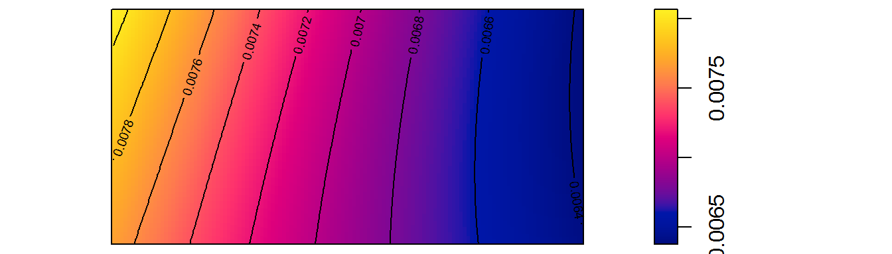


### Kernel Density Adjusted for Covariate {-}

In the following example, a kernel density map is generated using an elevation raster as a covariate. The outputs include a plot of $\rho$ vs. elevation and a raster map of $\rho$.


```r
library(spatstat)
P    <- bei              # Use built-in point dataset
elev <- bei.extra$elev   # Use built-in covariate

# Compute rho using the ratio method
rho <- rhohat(P, elev, method="ratio")

# Generate rho vs covariate plot
plot(rho, main=NULL)
```

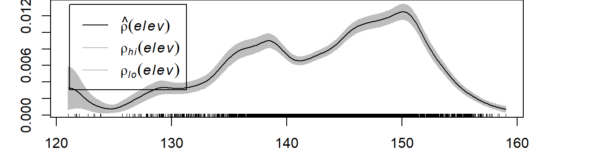


```r
# Generate map of rho
pred <- predict(rho)
cl <-  interp.colours(c("lightyellow", "orange" ,"red"), 100) # Create color scheme
plot(pred, col=cl, las=2, main=NULL)
```

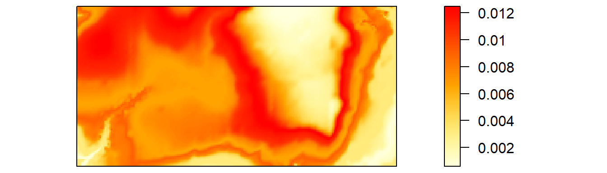

### Modeling intensity as a function of a covariate {-}

In this example, we make use of the Starbucks and population density datasets loaded at the beginning of this tutorial.

First, we'll map the data. The population density raster is mapped on a log scale.


```r
library(tmap)
tm_shape(r) + tm_raster(style="quantile", palette = "Greys") +
  tm_shape(S1) + tm_bubbles(col="red", alpha=0.5, 
                           border.col = "yellow", border.lwd = 0.5) + 
  tm_legend(outside = TRUE, text.size = .8) 
```

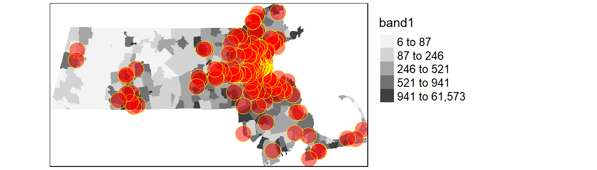

Next, we'll generate the Poisson point process model and plot the results. Note that we are using the `ppp` representation of the Starbucks points (object `p2`) and not the `SpatialPointsDataFrame` representation (object `S1`).


```r
library(spatstat)
# Create the Poisson point process model
PPM1 <- ppm(p2 ~ pop)

# Plot the relationship
plot(effectfun(PPM1, "pop", se.fit=TRUE), main=NULL, cex.axis=0.6,cex.lab=0.6,
     legend=FALSE)
```

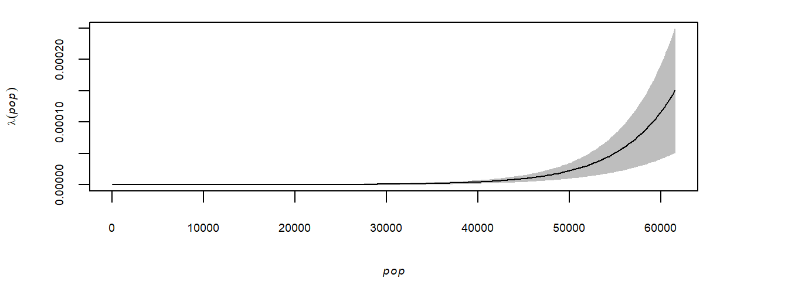

## Distance based analysis {-}

### Average nearest neighbor analysis {-}


```r
library(spatstat)
P <- bei
```

To compute the average **first** nearest neighbor distance (1^st^ order):


```r
mean(nndist(P, k=1))
```

```
[1] 4.329677
```

To compute the average **second** nearest neighbor distance (2^nd^ order):


```r
mean(nndist(P, k=2))
```

```
[1] 6.473149
```

To plot average distance as a function of neighbor order for the first 100 closest neighbors:


```r
ANN <- apply(nndist(P, k=1:100),2,FUN=mean)
plot(ANN ~ eval(1:100), type="b", main=NULL )
```

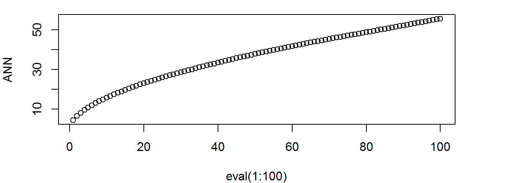

The bottom axis shows the neighbor order number and the left axis shows the average distance.

### K and L functions {-}


```r
library(spatstat)
P <- bei
```

To compute the K function:


```r
K <- Kest(P)
plot(K, main=NULL)
```

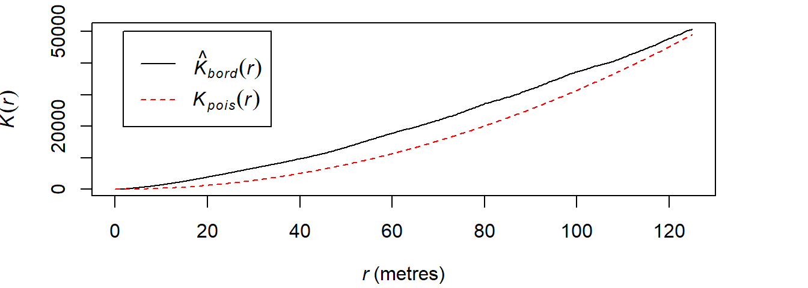

To compute the L function:


```r
L <- Lest(P, main=NULL)
plot(L)
```

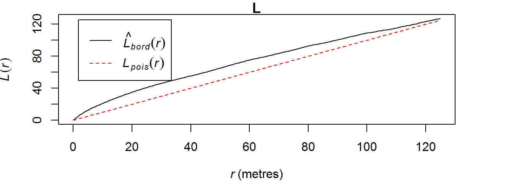

To plot the L function with the L~expected~ line set horizontal:


```r
plot(L, . -r ~ r)
```


### The Pair Correlation Function g {-}


```r
library(spatstat)
P <- swedishpines
```

To compute the pair correlation function.


```r
g <- pcf(P)
plot(g, main=NULL)
```

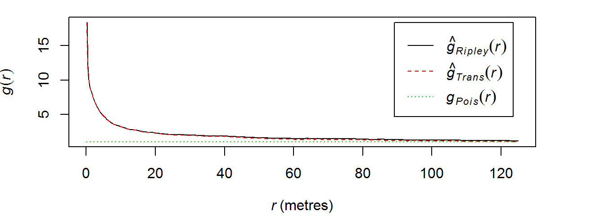

## Hypothesis tests {-}


### Test for clustering {-}

First, we'll compute the ANN for Walmart locations assuming uniform density across the state (i.e. assuming that there are no underlying factors at play).

Compute the observed data's ANN value,


```r
library(spatstat)
ann.p <- mean(nndist(p2, k=1))
```

Now run the MC simulation using a homogeneous point pattern density process


```r
n     <- 599      # This tells the model how many times to run the simulation
ann.r <- vector() # Create an empty object to be used to store simulated values
for (i in 1:n){
  rand.p   <- rpoint(n=p2$n, win=W)  # Generate the random point locations
  ann.r[i] <- mean(nndist(rand.p, k=1)) # Tally the ANN values
}
```

In the above loop, the function `rpoint` is passed two parameters: `n=p2k$n` and  `win=W`. The first tells the function how many points to randomly generate (`p2$n` extracts the number of points in object `p2`). The second tells the function to confine the points to the extent defined by `w` (the state of MA boundary).

Next, let's plot the histogram and add a blue line showing where our observed ANN value lies.


```r
hist(ann.r, breaks=40, col="bisque", xlim=range(ann.p, ann.r))
abline(v=ann.p, col="blue")
```

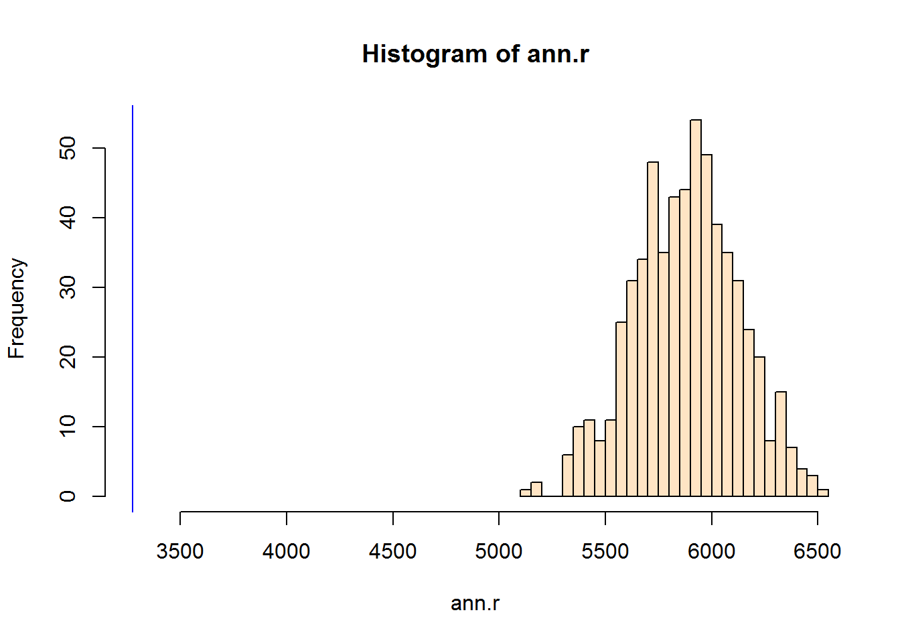

It's obvious from the test that the observed ANN is far smaller than the expected ANN values under the null hypothesis that the stores are randomly distributed across the state. A smaller value indicates that the stores are far more clustered than expected under the null. 

Next, we'll run the same test but add the influence due to population distribution. This is a non-homogeneous test.


```r
n     <- 599
ann.r <- vector()
for (i in 1:n){
  rand.p   <- rpoint(n=p2$n, f=pop) 
  ann.r[i] <- mean(nndist(rand.p, k=1))
}
```

Here, we pass the parameter `f=pop` to the function `rpoint` telling it that the population density raster `pop` should be used to define where a point should be most likely placed (high population density) and least likely placed (low population density). 


Next, let's plot the histogram and add a blue line showing where our observed ANN value lies.


```r
hist(ann.r, breaks=40, col="bisque", xlim=range(ann.p, ann.r))
abline(v=ann.p, col="blue")
```

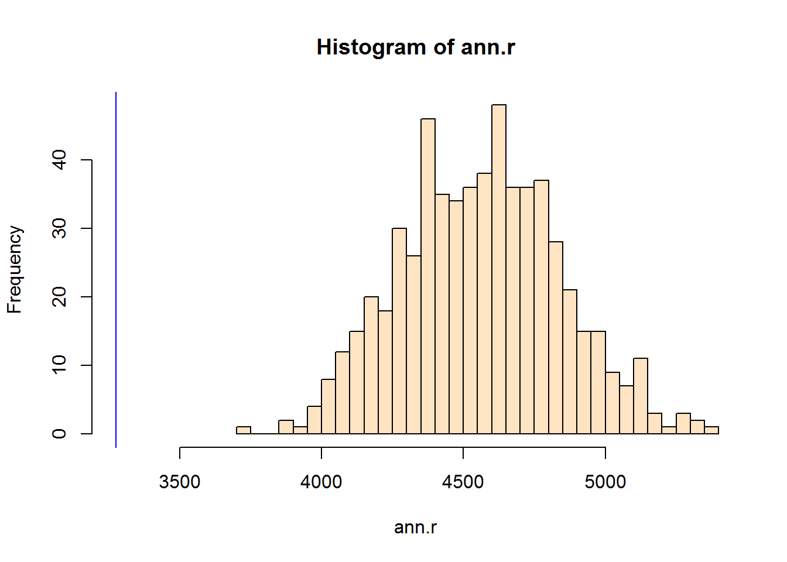

Population density alone cannot explain the clustering given that the observed ANN value is less than the expected ANN values.

### Computing a pseudo p-value {-}

We'll work off of the last simulation. First, we need to find the number of simulated ANN values greater than our observed ANN value


```r
N.greater <- sum(ann.r > ann.p)
```

To compute the p-value, find the end of the distribution closest to the observed ANN value, then divide that count by the total count. Note that this is a so-called one-sided P-value. See lecture notes for more information.


```r
p <- min(N.greater + 1, n + 1 - N.greater) / (n +1)
p
```

```
[1] 0.001666667
```

In our working example, you'll note that or simulated ANN value was nowhere near the range of ANN values computed under the null yet we don't have a p-value of zero. This is by design since the *strength* of our estimated p will be proportional to the number of simulations--there is always a chance that one *realization* of a point pattern could produce an ANN value more extreme than ours.


### Testing for a covariate effect {-}

It's important that the `p2` object have its extent defined so as to match the extent of the population raster `pop`. Plotting `p2` with the base plot function shows that the extent is currently defined by the smallest rectangle enclosing the points.


```r
plot(p2, main=NULL)
```


We can impose the Massachusetts boundary as the new extent as follows:


```r
Window(p2) <- W
plot(p2, main=NULL)
```


Now, we'll fit the model that assumes that point density *is* a function of population (the alternative hypothesis).


```r
library(spatstat)
PPM1 <- ppm(p2 ~ pop)
PPM1
```

```
Nonstationary Poisson process

Log intensity:  ~pop

Fitted trend coefficients:
  (Intercept)           pop 
-1.905198e+01  1.836711e-04 

                 Estimate         S.E.       CI95.lo       CI95.hi Ztest
(Intercept) -1.905198e+01 9.039783e-02 -1.922915e+01 -1.887480e+01   ***
pop          1.836711e-04 6.060545e-06  1.717927e-04  1.955496e-04   ***
                  Zval
(Intercept) -210.75700
pop           30.30604
Problem:
 Values of the covariate 'pop' were NA or undefined at 0.57% (4 out of 
699) of the quadrature points
```

Next, we'll fit the model that assumes that density is *not* a function of population (the null hypothesis).


```r
PPM0 <- ppm(p2 ~ 1)
PPM0
```

```
Stationary Poisson process
Intensity: 8.268627e-09
            Estimate       S.E.   CI95.lo   CI95.hi Ztest      Zval
log(lambda) -18.6108 0.07647191 -18.76068 -18.46092   *** -243.3678
```

In our working example, the null model (homogeneous intensity) takes on the form:

$$
\lambda(i) = e^{-18.6}
$$


The alternate model takes on the form:

$$
\lambda(i) = e^{-19.1 + 1.8^{-4}population}
$$


The models are then compared using the **likelihood ratio test** which produces the following output:


```r
anova(PPM0, PPM1, test="LRT")
```


 Npar   Df   Deviance   Pr(>Chi)
-----  ---  ---------  ---------
    5   NA         NA         NA
    6    1   347.4234          0

The value under the heading `PR(>Chi)` is the p-value which gives us the probability we would be wrong in rejecting the null. Here p~0 suggesting that there is close to a 0% chance that we would be remiss to reject the base model in favor of the alternate model--put another way, the alternate model (that population density can help explain the distribution of Starbucks) is a significant improvement over the null. 

